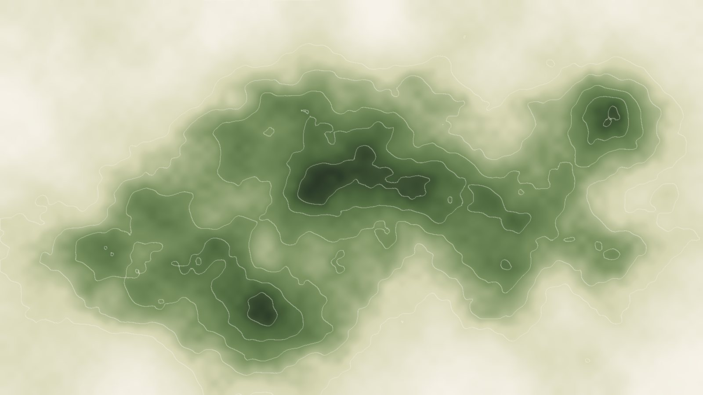
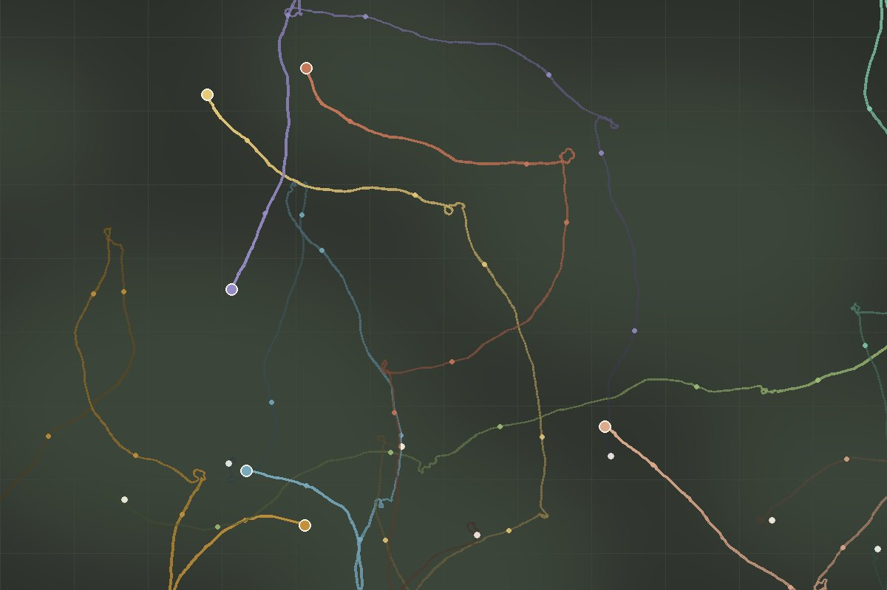
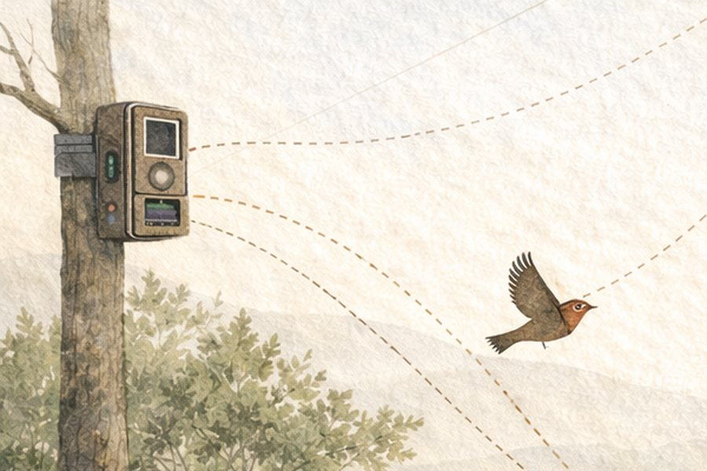
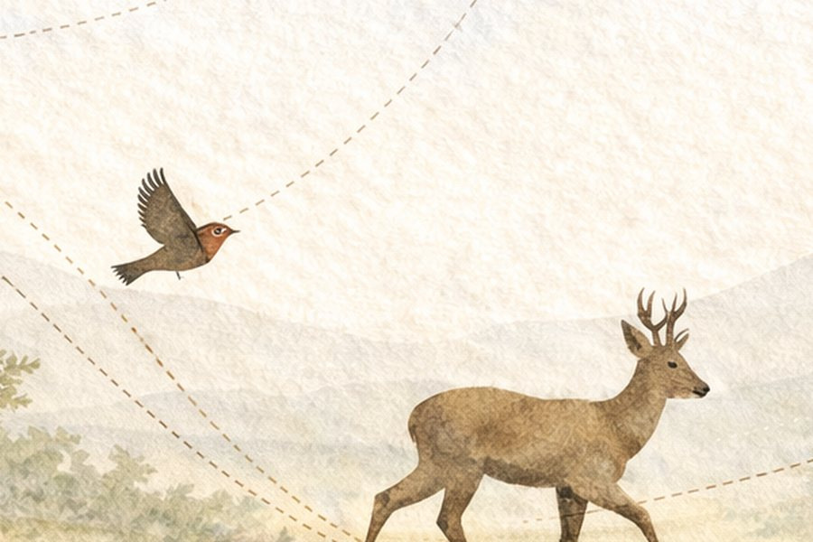
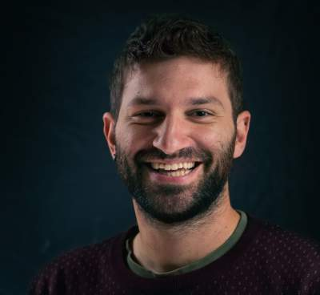

```{=html}
<style>.navbar-brand .navbar-title{display:none}</style>
<section class="hero" aria-label="Introduction">
  <picture>
    <source type="image/webp" srcset="../images/hero-sm.webp 900w, ../images/hero.webp 1536w" sizes="100vw">
    
  </picture>
  <svg class="hero-paths" viewBox="0 0 1600 900" preserveAspectRatio="xMidYMid slice" aria-hidden="true" focusable="false">
    <path d="M-40 620 C 260 540, 420 700, 700 560 S 1120 420, 1400 520 S 1580 640, 1700 600" />
    <path d="M-40 760 C 200 700, 380 820, 640 720 S 980 560, 1260 640 S 1520 760, 1700 700" />
    <path d="M 120 -20 C 300 160, 520 220, 760 180 S 1100 60, 1300 200 S 1500 420, 1700 380" />
  </svg>
  <div class="wrap hero-inner">
    <span class="eyebrow">Análisis cuantitativo de la biodiversidad · Movimiento · Conservación</span>
    <h1>Guillermo Fandos</h1>
    <p class="hero-tagline">Estudiamos cómo se mueven los animales, dónde viven y cómo conservarlos.</p>
    <p class="hero-affil">Investigación para entender el movimiento animal y conservar la biodiversidad en un mundo que cambia<br>Dpto. Biodiversidad, Ecología y Evolución · Universidad Complutense de Madrid</p>
    <div class="hero-actions">
      <a class="btn btn-primary" href="research/index.html">Nuestra investigación</a>
      <a class="btn btn-outline-dark" href="people.html#trabaja-con-nosotros">Trabaja con nosotros</a>
    </div>
  </div>
</section>

<section class="section">
  <div class="wrap wrap-narrow">
    <span class="eyebrow">Presentación</span>
    <p class="lead-text">Soy Guillermo Fandos, ecólogo espacial y Profesor Ayudante Doctor en la Universidad Complutense de Madrid. Mi investigación es el análisis cuantitativo de la biodiversidad: dónde están los animales, cómo se mueven y cómo responden las poblaciones a un mundo que cambia. Formo parte del grupo de investigación <a href="https://www.ucm.es/bcv/">Biología y Conservación Evolutiva</a> de la UCM.</p>
    <p class="lead-text">Junto con mis estudiantes y colaboradores, combinamos trabajo de campo, síntesis de datos a gran escala (anillamiento, ciencia ciudadana, fototrampeo, sensores acústicos) y modelización bayesiana, con especial atención al movimiento y la dispersión animal. El objetivo es siempre el mismo: convertir un mejor conocimiento en una mejor conservación, desde los Libros Rojos hasta la gestión de los Parques Nacionales.</p>
  </div>
</section>

<section class="databand" aria-label="Movimiento sobre una superficie de idoneidad de hábitat">
  <div class="databand-media">
    <picture>
      <source type="image/webp" srcset="../images/data/sdm.webp">
      
    </picture>
    <canvas id="tracks" aria-hidden="true"></canvas>
  </div>
  <div class="wrap databand-text">
    <span class="eyebrow">Espacio y movimiento, cuantificados</span>
    <h2>Dónde podrían vivir los animales, y cómo se mueven en realidad</h2>
    <p>Los modelos de distribución de especies nos dicen dónde el hábitat es idóneo. Los datos de movimiento nos dicen si los animales llegan hasta allí. Nuestro trabajo une las dos cosas y plantea la pregunta que importa para la conservación: qué poblaciones lo conseguirán, cuáles no, y dónde actuar marca la diferencia.</p>
    <p class="databand-note">Ilustración: trayectorias de dispersión simuladas sobre una superficie de idoneidad sintética. Las figuras reales de nuestros artículos están en las páginas de investigación.</p>
  </div>
</section>

<section class="section section-alt">
  <div class="wrap">
    <div class="section-head">
      <div>
        <span class="eyebrow">Investigación</span>
        <h2>Cuatro líneas de trabajo, una pregunta</h2>
        <p>¿Cómo dan forma, juntos, el movimiento animal y el cambio ambiental a la distribución de las especies, y qué podemos hacer al respecto?</p>
      </div>
      <a class="more" href="research/index.html">Visión general &rarr;</a>
    </div>
    <div class="card-grid">
      <article class="card-x">
        <figure><picture><source type="image/webp" srcset="../images/research/movement-card.webp"></picture></figure>
        <div class="card-body">
          <h3><a href="research/dispersal.html">Movimiento y dispersión</a></h3>
          <p>Del forrajeo diario a la dispersión natal: cuánto se mueven los animales, por qué varía y qué implica para la conectividad y la dinámica de las áreas de distribución.</p>
          <a class="card-link" href="research/dispersal.html">Read more</a>
        </div>
      </article>
      <article class="card-x">
        <figure><picture><source type="image/webp" srcset="../images/research/sdm-card.webp"></picture></figure>
        <div class="card-body">
          <h3><a href="research/forecasting.html">Seguimiento y modelización</a></h3>
          <p>Modelos de distribución de especies que incorporan dispersión, demografía e interacciones, e integran censos con ciencia ciudadana.</p>
          <a class="card-link" href="research/forecasting.html">Read more</a>
        </div>
      </article>
      <article class="card-x">
        <figure><picture><source type="image/webp" srcset="../images/research/conservation.webp"></picture></figure>
        <div class="card-body">
          <h3><a href="research/conservation.html">Conservación y cambio global</a></h3>
          <p>Expansión de grandes carnívoros, evaluación de especies amenazadas y conectividad del paisaje ante el cambio climático y de usos del suelo.</p>
          <a class="card-link" href="research/conservation.html">Read more</a>
        </div>
      </article>
      <article class="card-x">
        <figure><picture><source type="image/webp" srcset="../images/research/fieldtech.webp"></picture></figure>
        <div class="card-body">
          <h3><a href="research/fieldtech.html">Tecnología de campo</a></h3>
          <p>Fototrampeo, seguimiento acústico pasivo y flujos de datos de sensores para evaluar la fauna en ecosistemas mediterráneos.</p>
          <a class="card-link" href="research/fieldtech.html">Read more</a>
        </div>
      </article>
    </div>
  </div>
</section>

<section class="section section-tint">
  <div class="wrap">
    <div class="section-head">
      <div>
        <span class="eyebrow">Por qué importa</span>
        <h2>Investigación que llega a la práctica de la conservación</h2>
        <p>Un modelo solo es útil si alguien puede actuar a partir de él. Algunos lugares donde nuestro trabajo ha alimentado decisiones.</p>
      </div>
      <a class="more" href="research/conservation.html">Conservación y cambio global &rarr;</a>
    </div>
    <ul class="outcomes">
      <li>
        <span class="outcome-what">La cigüeña negra en el Libro Rojo</span>
        <span class="outcome-how">Modelos de ocupación que corrigen el muestreo preferencial convirtieron 22 años de seguimiento irregular en tendencias poblacionales robustas, usadas en la evaluación de la especie.</span>
      </li>
      <li>
        <span class="outcome-what">Hacia dónde irán lobos, osos y linces</span>
        <span class="outcome-how">Modelos de expansión y conectividad para los grandes carnívoros ibéricos identifican áreas prioritarias para una gestión proactiva antes de que surjan los conflictos.</span>
      </li>
      <li>
        <span class="outcome-what">Modelos de hábitat para el Atlas de murciélagos de España</span>
        <span class="outcome-how">Modelos de distribución para el atlas nacional, por encargo de TRAGSA, para localizar dónde es más necesario el esfuerzo de conservación.</span>
      </li>
      <li>
        <span class="outcome-what">Refugios de fauna en los ríos mediterráneos</span>
        <span class="outcome-how">Redes de fototrampeo y modelos dinámicos en Parques Nacionales localizan los corredores y refugios de sequía que la gestión fluvial debe proteger.</span>
      </li>
      <li>
        <span class="outcome-what">Una dispersión que los modelos por fin pueden usar</span>
        <span class="outcome-how">Kernels de dispersión estandarizados para 234 especies de aves europeas permiten que las predicciones de conservación tengan en cuenta si las especies pueden llegar al nuevo hábitat idóneo.</span>
      </li>
    </ul>
  </div>
</section>

<section class="section">
  <div class="wrap">
    <div class="section-head">
      <div>
        <span class="eyebrow">Proyectos</span>
        <h2>Proyectos activos</h2>
      </div>
      <a class="more" href="projects/index.html">Todos los proyectos &rarr;</a>
    </div>
    <div class="card-grid">
      <article class="card-x card-project">
        <div class="card-body">
          <span class="card-meta">Investigador principal · 2024–2026</span>
          <h3><a href="projects/intradisp.html">INTRADISP</a></h3>
          <p>¿Por qué individuos de la misma especie se dispersan de forma tan distinta? Cuantificamos la variación intraespecífica de la dispersión con datos de anillamiento europeos.</p>
          <a class="card-link" href="projects/intradisp.html">About the project</a>
        </div>
      </article>
      <article class="card-x card-project">
        <div class="card-body">
          <span class="card-meta">Miembro del equipo · 2024–2027</span>
          <h3><a href="projects/remined.html">RIMed-Fauna</a></h3>
          <p>¿Cómo afronta la fauna terrestre la estacionalidad extrema de los ríos mediterráneos? Fototrampeo y modelos de distribución en Parques Nacionales.</p>
          <a class="card-link" href="projects/remined.html">About the project</a>
        </div>
      </article>
      <article class="card-x card-project">
        <div class="card-body">
          <span class="card-meta">Miembro del equipo · 2025–2027</span>
          <h3><a href="projects/sharepoint.html">SHAREPOINT</a></h3>
          <p>Organización social y transmisión de parásitos entre aves del sotobosque de la selva de la Guayana Francesa.</p>
          <a class="card-link" href="projects/sharepoint.html">About the project</a>
        </div>
      </article>
    </div>
  </div>
</section>

<section class="section section-alt">
  <div class="wrap">
    <div class="feature">
      <figure>
        <picture><source type="image/webp" srcset="../images/research/dispersal.webp"></picture>
      </figure>
      <div>
        <span class="eyebrow">Artículo destacado</span>
        <h3>Simple mechanistic traits outperform complex syndromes in predicting avian dispersal distances</h3>
        <p class="cite">Fandos, G., Robinson, R. A. &amp; Zurell, D. (2026). <em>Communications Biology</em> 9: 376.</p>
        <p>Con el conjunto de datos empíricos de dispersión más completo para las aves europeas, mostramos que rasgos mecanísticos aislados predicen mejor la dispersión que los síndromes compuestos. La masa corporal y la historia de vida dominan la distancia mediana; la eficiencia de vuelo determina los movimientos a larga distancia que impulsan la expansión de las áreas de distribución.</p>
        <div class="hero-actions">
          <a class="btn btn-primary" href="https://doi.org/10.1038/s42003-026-09676-x">Leer el artículo</a>
          <a class="btn btn-outline-dark" href="https://zenodo.org/records/10713958">Código y datos</a>
        </div>
      </div>
    </div>
  </div>
</section>

<section class="section">
  <div class="wrap wrap-narrow">
    <div class="section-head">
      <div>
        <span class="eyebrow">Noticias</span>
        <h2>Últimas noticias</h2>
      </div>
      <a class="more" href="news/index.html">Todas las noticias &rarr;</a>
    </div>
```

::: {#news-home}
:::

```{=html}
  </div>
</section>

<section class="section section-tint">
  <div class="wrap">
    <div class="section-head">
      <div>
        <span class="eyebrow">Personas</span>
        <h2>El equipo</h2>
      </div>
      <a class="more" href="people.html">Conoce al equipo &rarr;</a>
    </div>
    <div class="team-strip">
      <a class="member" href="people.html">
        
        <span><span class="name">Guillermo Fandos</span><br><span class="role">Investigador principal</span></span>
      </a>
      <a class="member" href="people.html">
        <span class="avatar avatar-initials" aria-hidden="true">DN</span>
        <span><span class="name">David Notario</span><br><span class="role">Técnico de investigación · INTRADISP</span></span>
      </a>
      <a class="member" href="people.html">
        <span class="avatar avatar-initials" aria-hidden="true">CM</span>
        <span><span class="name">Claudia Mediavilla</span><br><span class="role">Doctoranda · RIMed-Fauna</span></span>
      </a>
      <a class="member" href="people.html">
        <span class="avatar avatar-initials" aria-hidden="true">HD</span>
        <span><span class="name">Hugo Díaz</span><br><span class="role">Doctorando · CE3C</span></span>
      </a>
      <a class="member" href="people.html#investigadores-visitantes">
        <span class="avatar avatar-initials" aria-hidden="true">JH</span>
        <span><span class="name">Jakub Hrouda</span><br><span class="role">Estudiante visitante · Praga</span></span>
      </a>
    </div>
  </div>
</section>

<section class="section">
  <div class="wrap">
    <div class="callout-join callout-join-light">
      <div>
        <h2>¿Te interesa trabajar con nosotros?</h2>
        <p>Buscamos estudiantes motivados para TFM, doctorado y proyectos postdoctorales en análisis cuantitativo de la biodiversidad, movimiento animal y conservación. <a href="people.html#trabaja-con-nosotros">Cómo contactar</a>.</p>
      </div>
      <a class="btn btn-primary" href="mailto:gfandos@ucm.es">Escríbenos</a>
    </div>
  </div>
</section>

<section class="section section-alt" id="contact">
  <div class="wrap">
    <div class="feature" style="align-items:start">
      <div>
        <span class="eyebrow">Contacto</span>
        <h2 style="margin-top:0">Dónde estamos</h2>
        <p><strong>Guillermo Fandos</strong><br>
        Departamento de Biodiversidad, Ecología y Evolución<br>
        Facultad de Ciencias Biológicas, Universidad Complutense de Madrid<br>
        C/ José Antonio Novais 12, 28040 Madrid</p>
        <p><a href="mailto:gfandos@ucm.es">gfandos@ucm.es</a></p>
      </div>
      <div class="logo-row">
        
      </div>
    </div>
  </div>
</section>
```

```{=html}
<script>
(function(){
  var cv=document.getElementById('tracks'); if(!cv) return;
  var ctx=cv.getContext('2d'), dpr=Math.min(window.devicePixelRatio||1,2);
  var C=[[0.22,0.62],[0.47,0.36],[0.70,0.58],[0.86,0.28],[0.38,0.80]];
  var reduce=window.matchMedia('(prefers-reduced-motion: reduce)').matches;
  var W,H,walkers=[],t=0;
  function seed(s){return function(){s=(s*1664525+1013904223)%4294967296;return s/4294967296;};}
  var rnd=seed(7);
  function gauss(){var u=rnd()||1e-6,v=rnd();return Math.sqrt(-2*Math.log(u))*Math.cos(2*Math.PI*v);}
  function resize(){
    var r=cv.parentElement.getBoundingClientRect(); W=r.width; H=r.height;
    cv.width=W*dpr; cv.height=H*dpr; cv.style.width=W+'px'; cv.style.height=H+'px';
    ctx.setTransform(dpr,0,0,dpr,0,0); ctx.clearRect(0,0,W,H);
    walkers=[]; for(var i=0;i<9;i++){var c=C[Math.floor(rnd()*C.length)];
      walkers.push({x:c[0]*W+(rnd()-0.5)*60,y:c[1]*H+(rnd()-0.5)*60,a:rnd()*6.28,tgt:C[Math.floor(rnd()*C.length)],trail:[]});}
    t=0;
    for(var k=0;k<160;k++){t++;walkers.forEach(step);} draw();
  }
  function step(w){
    if(t%75===0) w.tgt=C[Math.floor(rnd()*C.length)];
    var want=Math.atan2(w.tgt[1]*H-w.y,w.tgt[0]*W-w.x);
    var diff=((want-w.a+Math.PI)%(2*Math.PI)+2*Math.PI)%(2*Math.PI)-Math.PI;
    w.a+=0.12*diff+gauss()*0.3;
    var sp=Math.max(2,W/300);
    w.x+=Math.cos(w.a)*sp; w.y+=Math.sin(w.a)*sp;
    if(w.x<20||w.x>W-20){w.a=Math.PI-w.a;w.x=Math.min(Math.max(w.x,20),W-20);}
    if(w.y<20||w.y>H-20){w.a=-w.a;w.y=Math.min(Math.max(w.y,20),H-20);}
    w.trail.push([w.x,w.y]); if(w.trail.length>220) w.trail.shift();
  }
  function draw(){
    ctx.clearRect(0,0,W,H);
    walkers.forEach(function(w){
      for(var i=1;i<w.trail.length;i++){
        var k=i/w.trail.length;
        ctx.strokeStyle='rgba(194,145,58,'+(0.15+0.75*k)+')'; ctx.lineWidth=1.6;
        ctx.beginPath(); ctx.moveTo(w.trail[i-1][0],w.trail[i-1][1]); ctx.lineTo(w.trail[i][0],w.trail[i][1]); ctx.stroke();
      }
      ctx.fillStyle='#c2913a'; ctx.strokeStyle='#f7f3ea'; ctx.lineWidth=1.5;
      ctx.beginPath(); ctx.arc(w.x,w.y,4,0,6.28); ctx.fill(); ctx.stroke();
    });
  }
  var running=true;
  function loop(){ if(!running) return; t++; walkers.forEach(step); draw(); requestAnimationFrame(loop); }
  resize(); window.addEventListener('resize',resize);
  if(reduce){ for(var k=0;k<220;k++){t++;walkers.forEach(step);} draw(); return; }
  if('IntersectionObserver' in window){
    new IntersectionObserver(function(e){ var vis=e[0].isIntersecting; if(vis&&!running){running=true;loop();} if(!vis){running=false;} }).observe(cv);
  }
  loop();
})();
</script>
```
