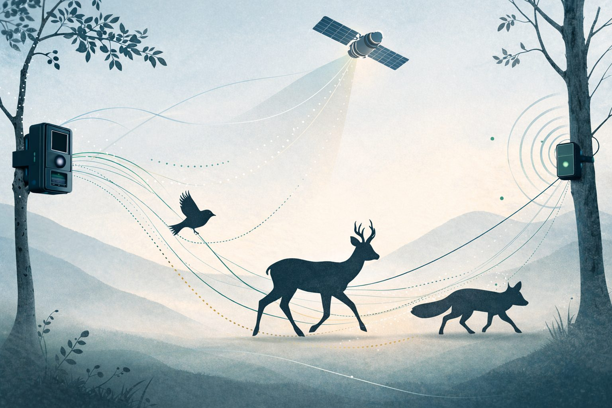

```{=html}
<style>.navbar-brand .navbar-title{display:none}</style>
<section class="hero" aria-label="Introduction">
  <picture>
    <source type="image/webp" srcset="images/hero-sm.webp 900w, images/hero.webp 1536w" sizes="100vw">
    
  </picture>
  <svg class="hero-paths" viewBox="0 0 1600 900" preserveAspectRatio="xMidYMid slice" aria-hidden="true" focusable="false">
    <path d="M-40 620 C 260 540, 420 700, 700 560 S 1120 420, 1400 520 S 1580 640, 1700 600" />
    <path d="M-40 760 C 200 700, 380 820, 640 720 S 980 560, 1260 640 S 1520 760, 1700 700" />
    <path d="M 120 -20 C 300 160, 520 220, 760 180 S 1100 60, 1300 200 S 1500 420, 1700 380" />
  </svg>
  <div class="wrap hero-inner">
    <span class="eyebrow">Quantitative biodiversity analysis · Movement · Conservation</span>
    <h1>Guillermo Fandos</h1>
    <p class="hero-tagline">We study how animals move, where they live, and how to keep them there.</p>
    <p class="hero-affil">Research to understand animal movement and to conserve biodiversity in a changing world<br>Dept. Biodiversidad, Ecología y Evolución · Universidad Complutense de Madrid</p>
    <div class="hero-actions">
      <a class="btn btn-primary" href="research/index.html">Our research</a>
      <a class="btn btn-outline-dark" href="people.html#work-with-us">Work with us</a>
    </div>
  </div>
  <div class="hero-cue" aria-hidden="true"><span></span></div>
</section>

<section class="section">
  <div class="wrap wrap-narrow">
    <span class="eyebrow">About</span>
    <p class="lead-text">I'm Guillermo Fandos, a spatial ecologist and Assistant Professor at Universidad Complutense de Madrid. My research is the quantitative analysis of biodiversity: where animals occur, how they move, and how populations respond to a changing world. I am a member of the <a href="https://www.ucm.es/bcv/">Biología y Conservación Evolutiva</a> research group at UCM.</p>
    <p class="lead-text">Together with my students and collaborators, we combine fieldwork, large-scale data synthesis (bird ringing, citizen science, camera traps, acoustic sensors) and Bayesian modelling, with a particular focus on animal movement and dispersal. The goal is always the same: turn better understanding into better conservation, from Red List assessments to the management of National Parks.</p>
  </div>
</section>

<section class="story" data-step="1" aria-label="Space and movement, quantified">
  <div class="wrap story-grid">
    <div class="story-steps">
      <span class="eyebrow">Space and movement, quantified</span>
      <h2>From suitable habitat to conservation action</h2>
      <div class="story-step active" data-step="1"><span class="story-n">01</span><h3>Where could they live?</h3><p>Species distribution models turn surveys, citizen science and climate into a map of suitable habitat. They say where a species could persist, not whether it will get there.</p></div>
      <div class="story-step" data-step="2"><span class="story-n">02</span><h3>Where do they actually go?</h3><p>Ring recoveries and tracking show how far individuals move, and how much that varies between them. Dispersal is the missing link between suitability and occupancy.</p></div>
      <div class="story-step" data-step="3"><span class="story-n">03</span><h3>Where does action make the difference?</h3><p>Joining the two identifies the corridors, refugia and priority areas where acting now avoids losses later. That is the question our models are built to answer.</p></div>
      <p class="story-note">Illustration: simulated trajectories over a synthetic suitability surface.</p>
    </div>
    <div class="story-media">
      <div class="story-frame">
        <picture class="layer layer-sdm">
          <source type="image/webp" srcset="images/data/sdm.webp">
          
        </picture>
        <canvas id="tracks" class="layer layer-tracks" aria-hidden="true"></canvas>
        <svg class="layer layer-priority" viewBox="0 0 1600 900" preserveAspectRatio="none" aria-hidden="true">
          <defs><pattern id="hatch" width="14" height="14" patternUnits="userSpaceOnUse" patternTransform="rotate(45)"><line x1="0" y1="0" x2="0" y2="14" stroke="#c2913a" stroke-width="3"/></pattern></defs>
          <ellipse cx="352" cy="558" rx="150" ry="120" fill="url(#hatch)" opacity="0.55"/>
          <ellipse cx="1120" cy="522" rx="170" ry="130" fill="url(#hatch)" opacity="0.55"/>
          <path d="M 500 560 C 640 430, 780 420, 960 500" fill="none" stroke="#f7f3ea" stroke-width="5" stroke-dasharray="14 12"/>
          <ellipse cx="352" cy="558" rx="150" ry="120" fill="none" stroke="#f7f3ea" stroke-width="3"/>
          <ellipse cx="1120" cy="522" rx="170" ry="130" fill="none" stroke="#f7f3ea" stroke-width="3"/>
        </svg>
        <div class="story-legend"><span class="lg lg-1">Suitability</span><span class="lg lg-2">Movement</span><span class="lg lg-3">Priority areas</span></div>
      </div>
    </div>
  </div>
</section>

<section class="section section-alt">
  <div class="wrap">
    <div class="section-head">
      <div>
        <span class="eyebrow">Research</span>
        <h2>Four lines of work, one question</h2>
        <p>How do animal movement and environmental change together shape the distribution of species, and what can we do about it?</p>
      </div>
      <a class="more" href="research/index.html">Research overview &rarr;</a>
    </div>
    <div class="lines">
      <a class="line" href="research/dispersal.html">
        <picture><source type="image/webp" srcset="images/research/movement-card.webp"></picture>
        <span class="line-title">Movement &amp; Dispersal</span>
        <span class="line-text">From daily foraging to natal dispersal: how far animals move, why it varies, and what it means for connectivity and range dynamics.</span>
      </a>
      <a class="line" href="research/forecasting.html">
        <picture><source type="image/webp" srcset="images/research/sdm-card.webp"></picture>
        <span class="line-title">Monitoring &amp; Modelling</span>
        <span class="line-text">Species distribution models that include dispersal, demography and species interactions, and integrate surveys with citizen science.</span>
      </a>
      <a class="line" href="research/conservation.html">
        <picture><source type="image/webp" srcset="images/research/conservation.webp"></picture>
        <span class="line-title">Conservation &amp; Global Change</span>
        <span class="line-text">Large carnivore expansion, threatened species assessment and landscape connectivity under climate and land-use change.</span>
      </a>
      <a class="line" href="research/fieldtech.html">
        <picture><source type="image/webp" srcset="images/research/fieldtech.webp"></picture>
        <span class="line-title">Field Technology</span>
        <span class="line-text">Camera trapping, passive acoustic monitoring and sensor pipelines for wildlife assessment in Mediterranean ecosystems.</span>
      </a>
    </div>
    </div>
  </div>
</section>

<section class="section section-tint">
  <div class="wrap">
    <div class="section-head">
      <div>
        <span class="eyebrow">Why it matters</span>
        <h2>Research that reaches conservation practice</h2>
        <p>Models are only useful if someone can act on them. Some of the places where our work has fed into decisions.</p>
      </div>
      <a class="more" href="research/conservation.html">Conservation &amp; global change &rarr;</a>
    </div>
    <ul class="outcomes">
      <li>
        <span class="outcome-what">Black Stork on the Spanish Red List</span>
        <span class="outcome-how">Occupancy models that correct for preferential sampling turned 22 years of uneven monitoring into robust population trends used in the species assessment.</span>
      </li>
      <li>
        <span class="outcome-what">Where wolves, bears and lynx will go next</span>
        <span class="outcome-how">Range-expansion and connectivity models for Iberian large carnivores identify priority areas for proactive management before conflicts emerge.</span>
      </li>
      <li>
        <span class="outcome-what">Habitat models for the Spanish Bat Atlas</span>
        <span class="outcome-how">Species distribution models for the national atlas, commissioned by TRAGSA, to map where bat conservation effort is most needed.</span>
      </li>
      <li>
        <span class="outcome-what">Wildlife refugia in Mediterranean rivers</span>
        <span class="outcome-how">Camera-trap networks and dynamic models in National Parks locate the corridors and drought refuges that river management must protect.</span>
      </li>
      <li>
        <span class="outcome-what">Dispersal that models can finally use</span>
        <span class="outcome-how">Standardised dispersal kernels for 234 European bird species let conservation forecasts include whether species can actually reach newly suitable habitat.</span>
      </li>
    </ul>
  </div>
</section>

<section class="section">
  <div class="wrap">
    <div class="section-head">
      <div>
        <span class="eyebrow">Projects</span>
        <h2>Active projects</h2>
      </div>
      <a class="more" href="projects/index.html">All projects &rarr;</a>
    </div>
    <div class="ledger" role="list">
      <div class="ledger-head" aria-hidden="true"><span>Project</span><span></span><span>Role</span><span>Years</span></div>
      <a class="ledger-row is-pi" href="projects/intradisp.html" role="listitem">
        <span class="ledger-name">INTRADISP</span>
        <span class="ledger-desc">Why do individuals of the same species disperse so differently? Intraspecific dispersal variation from European ringing data.</span>
        <span class="ledger-role">Principal Investigator</span>
        <span class="ledger-years">2024–2026</span>
      </a>
      <a class="ledger-row" href="projects/remined.html" role="listitem">
        <span class="ledger-name">RIMed-Fauna</span>
        <span class="ledger-desc">How terrestrial wildlife copes with the extreme seasonality of Mediterranean rivers. Camera traps and SDMs in National Parks.</span>
        <span class="ledger-role">Team member</span>
        <span class="ledger-years">2024–2027</span>
      </a>
      <a class="ledger-row" href="projects/sharepoint.html" role="listitem">
        <span class="ledger-name">SHAREPOINT</span>
        <span class="ledger-desc">Social organisation and parasite sharing among rainforest understory birds in French Guiana.</span>
        <span class="ledger-role">Team member</span>
        <span class="ledger-years">2025–2027</span>
      </a>
    </div>
    </div>
  </div>
</section>

<section class="section section-alt">
  <div class="wrap">
    <div class="feature">
      <figure class="plate">
        <picture><source type="image/webp" srcset="images/research/dispersal.webp"></picture>
        <figcaption>Fig. 1 · Dispersal trajectories over suitable habitat (illustration). The paper's own figures are open access.</figcaption>
      </figure>
      <div>
        <span class="eyebrow">Featured paper</span>
        <h3>Simple mechanistic traits outperform complex syndromes in predicting avian dispersal distances</h3>
        <p class="cite">Fandos, G., Robinson, R. A. &amp; Zurell, D. (2026). <em>Communications Biology</em> 9: 376.</p>
        <p>Using the most comprehensive empirical dispersal dataset for European birds, we show that single mechanistic traits predict dispersal better than composite syndromes. Body mass and life history dominate median dispersal distance, while flight efficiency shapes the long-distance movements that drive range expansion.</p>
        <div class="hero-actions">
          <a class="btn btn-primary" href="https://doi.org/10.1038/s42003-026-09676-x">Read the paper</a>
          <a class="btn btn-outline-dark" href="https://zenodo.org/records/10713958">Code &amp; data</a>
        </div>
      </div>
    </div>
  </div>
</section>

<section class="section">
  <div class="wrap wrap-narrow">
    <div class="section-head">
      <div>
        <span class="eyebrow">News</span>
        <h2>Latest news</h2>
      </div>
      <a class="more" href="news/index.html">All news &rarr;</a>
    </div>
```

::: {#news-home}
:::

```{=html}
  </div>
</section>

<section class="section section-tint">
  <div class="wrap">
    <div class="section-head">
      <div>
        <span class="eyebrow">People</span>
        <h2>The team</h2>
      </div>
      <a class="more" href="people.html">Meet everyone &rarr;</a>
    </div>
    <ul class="roster">
      <li><a href="people.html"><span class="name">Guillermo Fandos</span><span class="role">Principal Investigator</span></a></li>
      <li><a href="people.html"><span class="name">David Notario Rincón</span><span class="role">Research assistant · INTRADISP</span></a></li>
      <li><a href="people.html"><span class="name">Claudia Mediavilla Bailo</span><span class="role">PhD candidate · RIMed-Fauna</span></a></li>
      <li><a href="people.html"><span class="name">Hugo Díaz Santaolalla</span><span class="role">PhD student · CE3C Lisbon</span></a></li>
      <li><a href="people.html#visiting-researchers"><span class="name">Jakub Hrouda</span><span class="role">Visiting student · Prague</span></a></li>
      <li class="roster-more"><a href="people.html"><span class="name">Alumni, collaborators and how to join &rarr;</span></a></li>
    </ul>
    </div>
  </div>
</section>

<section class="joinband" aria-label="Come and work with us">
  <picture>
    <source type="image/webp" srcset="images/hero-dark-sm.webp 900w, images/hero-dark.webp 1536w" sizes="100vw">
    
  </picture>
  <div class="wrap joinband-inner">
    <span class="eyebrow">Students, PhD candidates, visitors</span>
    <h2>Come and work with us</h2>
    <p>We welcome motivated people for TFM, PhD and postdoctoral projects in quantitative biodiversity analysis, animal movement and conservation. Bring a question; we have the data and the models. <a href="people.html#work-with-us">How to get in touch</a>.</p>
    <a class="btn btn-primary" href="mailto:gfandos@ucm.es">Write to us</a>
  </div>
</section>

<section class="section section-alt" id="contact">
  <div class="wrap">
    <div class="feature" style="align-items:start">
      <div>
        <span class="eyebrow">Contact</span>
        <h2 style="margin-top:0">Find us</h2>
        <p><strong>Guillermo Fandos</strong><br>
        Departamento de Biodiversidad, Ecología y Evolución<br>
        Facultad de Ciencias Biológicas, Universidad Complutense de Madrid<br>
        C/ José Antonio Novais 12, 28040 Madrid, Spain</p>
        <p><a href="mailto:gfandos@ucm.es">gfandos@ucm.es</a></p>
      </div>
      <div class="logo-row">
        
      </div>
    </div>
  </div>
</section>
```

```{=html}
<script src="assets/home.js" defer></script>
```
