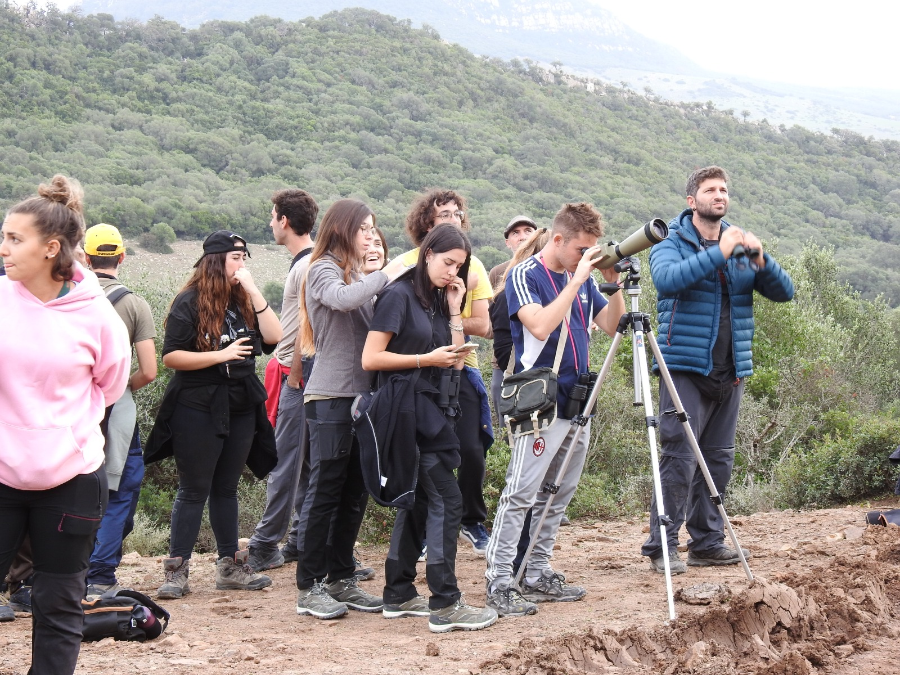

Profesor Ayudante Doctor en el Departamento de Biodiversidad, Ecología y Evolución de la Universidad Complutense de Madrid. Ecólogo espacial dedicado al análisis cuantitativo de la biodiversidad, el movimiento animal y la conservación. Miembro del grupo de investigación <a href="https://www.ucm.es/bcv/">Biología y Conservación Evolutiva</a> (BCV).

[Google Scholar](https://scholar.google.es/citations?user=8zRbuNgAAAAJ) · [ORCID 0000-0003-1579-9444](https://orcid.org/0000-0003-1579-9444) · [Perfil investigador UCM](https://produccioncientifica.ucm.es/investigadores/446092/detalle) · [Publicaciones](publications.html)

## Puestos

```{=html}
<ul class="cv-list">
  <li><span class="when">2023–actualidad</span><span class="what"><strong>Profesor Ayudante Doctor</strong><span>Dpto. Biodiversidad, Ecología y Evolución, Universidad Complutense de Madrid</span></span></li>
  <li><span class="when">2022–2023</span><span class="what"><strong>Investigador UNA4CAREER (H2020-MSCA-COFUND)</strong><span>Universidad Complutense de Madrid · proyecto INCISE</span></span></li>
  <li><span class="when">2018–2022</span><span class="what"><strong>Investigador postdoctoral</strong><span>Grupo de Macroecología de Damaris Zurell, Humboldt-Universität zu Berlin y Universidad de Potsdam · proyecto BIOPIC (DFG)</span></span></li>
</ul>
```

## Formación

```{=html}
<ul class="cv-list">
  <li><span class="when">2017</span><span class="what"><strong>Doctor en Ecología</strong><span>Universidad Complutense de Madrid</span></span></li>
  <li><span class="when">2012</span><span class="what"><strong>Máster en Biología de la Conservación</strong><span>Universidad Complutense de Madrid</span></span></li>
  <li><span class="when">2011</span><span class="what"><strong>Licenciado en Biología</strong><span>Universidad Complutense de Madrid</span></span></li>
</ul>
```

## Proyectos financiados

```{=html}
<ul class="cv-list">
  <li><span class="when">2024–2026</span><span class="what"><strong>INTRADISP <em>· Investigador principal</em></strong><span>Variación intraespecífica de la dispersión en aves europeas · UCM Doctores Emergentes (PR17/24)</span></span></li>
  <li><span class="when">2025–2027</span><span class="what"><strong>SHAREPOINT <em>· Miembro del equipo</em></strong><span>Organización social y transmisión de parásitos en aves de la selva, Guayana Francesa · IP Javier Pérez-Tris</span></span></li>
  <li><span class="when">2024–2027</span><span class="what"><strong>RIMed-Fauna <em>· Miembro del equipo</em></strong><span>Fauna en ecosistemas fluviales mediterráneos · Red de Parques Nacionales · IP María del Mar Sánchez-Montoya</span></span></li>
  <li><span class="when">2022–2023</span><span class="what"><strong>INCISE <em>· Investigador principal</em></strong><span>Integración de ciencia ciudadana y censos estandarizados · H2020-MSCA-COFUND UNA4CAREER</span></span></li>
  <li><span class="when">2019–2021</span><span class="what"><strong>RangeDyn <em>· Equipo principal</em></strong><span>Del patrón al proceso en la dinámica de las áreas de distribución · DAAD · IP Damaris Zurell</span></span></li>
  <li><span class="when">2018–2023</span><span class="what"><strong>BIOPIC <em>· Responsable del paquete de trabajo de dispersión</em></strong><span>Demografía, dispersión e interacciones bióticas ante el cambio global · DFG · IP Damaris Zurell</span></span></li>
</ul>
```

**Contratos aplicados**: modelización del hábitat de murciélagos para el Atlas de murciélagos de España (TRAGSA, 2024–2025); dinámica poblacional de la cigüeña negra para la evaluación del Libro Rojo (Junta de Castilla y León, 2017–2018).

## Dirección de trabajos

- Actualmente: 3 investigadores (técnico de investigación, doctoranda y doctorando codirigido), 1 estudiante visitante y 4 TFM en curso. Ver [Personas](people.html).
- Finalizados: 11 TFM (másteres de Zoología y Biología de la Conservación de la UCM; Humboldt-Universität zu Berlin) y 5 TFG. Miembro de tribunales de tesis doctoral en la UCM.

## Docencia

Docencia de grado y máster en la UCM en zoología, análisis de la biodiversidad animal, seguimiento de poblaciones amenazadas y evaluación ambiental (Grado en Biología; Máster en Biología de la Conservación; Máster en Zoología). Coimparte *Introducción a la programación en R* en la Escuela de Doctorado de la UCM. Coordinador del curso de experto de 150 horas *Aplicaciones Bioinformáticas en Biodiversidad, Ecología y Evolución*. Codesarrollador del curso de máster *Quantitative Conservation Biogeography* con Damaris Zurell. Ver [Docencia](teaching.html).

## Labor editorial y servicio

- **Editor** de *Ardeola*, la revista de la Sociedad Española de Ornitología (SEO/BirdLife).
- Revisor habitual para revistas de ecología y conservación.
- Revisor y colaborador de [eBird](https://ebird.org/home), contribuyendo a la calidad de los datos de uno de los mayores proyectos de ciencia ciudadana del mundo.
- Miembro de la Acción COST [EUFLYNET](https://www.cost.eu/actions/CA22117/) sobre investigación de la migración de aves.

## Divulgación

Ponente en **Pint of Science** (Berlín) y cocoordinador de la edición de Potsdam. Talleres sobre ecología de murciélagos y fototrampeo en **La Noche de los Investigadores**.

{width=100% fig-alt="Estudiantes observando aves en el campo durante una actividad de divulgación"}

## Experiencia de campo

Además de los proyectos actuales, trabajo de campo y expediciones en:

- **Guayana Francesa**: comunidades de aves de selva (proyectos CEBA)
- **Honduras**: investigación en pequeños mamíferos con Operation Wallacea
- **Costa Rica**: ecología de mamíferos en la Estación Biológica La Selva
- **España y Marruecos**: proyectos de seguimiento de aves

## Ciencia abierta

El código y los datos de nuestros artículos están disponibles en [GitHub](https://github.com/guifandos) y archivados en [Zenodo](https://zenodo.org/search?q=fandos).
