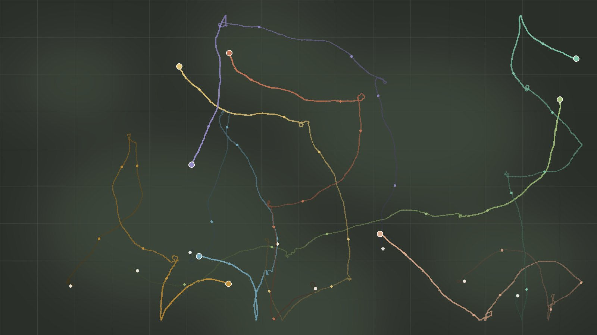

::: {.column-screen .banner-wrap}
{.page-banner fig-alt=""}
:::

El movimiento conecta a los individuos con su entorno a todas las escalas: desde las decisiones diarias de forrajeo hasta las migraciones estacionales entre continentes. Entenderlo es central para la ecología y la conservación, porque determina cómo se conectan las poblaciones, cómo siguen las especies a un ambiente cambiante y cómo encuentran los individuos recursos y pareja.

## Dispersión: la pieza que falta

La dispersión (el movimiento de un individuo desde donde nace hasta donde se reproduce) condiciona casi todo en ecología. Determina el flujo génico, dibuja los límites de distribución, permite colonizar nuevas áreas y rescata poblaciones en declive. Y sin embargo, para la mayoría de las especies simplemente no sabemos cuánto se dispersan sus individuos.

Los enfoques tradicionales chocan con un problema básico: hay que seguir a los individuos desde el nacimiento hasta la reproducción, algo logísticamente imposible a gran escala. El radioseguimiento da datos detallados pero muestras minúsculas. Los métodos genéticos hablan de patrones a largo plazo pero pierden la escala ecológica que nos interesa.

## Estimar la dispersión con datos de anillamiento

Trabajamos con **datos de anillamiento**: millones de registros procedentes de décadas de marcaje sistemático en toda Europa. El reto es que estos datos no se diseñaron para estudiar dispersión y están llenos de sesgos (los anilladores se concentran cerca de las ciudades, las recuperaciones dependen de la densidad humana, etc.).

Junto con colaboradores, desarrollamos métodos bayesianos que corrigen esos sesgos y extraen estimaciones fiables de dispersión. El resultado fueron los primeros kernels de dispersión estandarizados para más de 200 especies de aves europeas ([Fandos et al. 2023, JAE](https://doi.org/10.1111/1365-2656.13838)).

## Qué hemos encontrado

La gran sorpresa: **la dispersión a larga distancia es mucho más frecuente de lo que pensábamos.** Incluso especies "sedentarias" recorren a veces cientos de kilómetros. Importa porque esos eventos raros son precisamente los que impulsan las expansiones de área y mantienen la conectividad entre poblaciones lejanas.

Ahora exploramos por qué la dispersión varía tanto *dentro* de cada especie. Una misma especie puede mostrar patrones muy distintos según la densidad poblacional, la calidad del hábitat o la condición individual. Entender esa dependencia del contexto es clave para predecir cómo responderán las especies al cambio ambiental.

## Publicaciones seleccionadas

La lista completa está en la página de [Publicaciones](../publications.html).

**Fandos, G.**, Robinson, R. A., & Zurell, D. (2026). **Simple mechanistic traits outperform complex syndromes in predicting avian dispersal distances.** *Communications Biology*, 9, 376. [DOI](https://doi.org/10.1038/s42003-026-09676-x)

Wolff, J., **Fandos, G.**, Albert, C. H., Bocedi, G., Travis, J. M. J., & Zurell, D. (2026). **Habitat fragmentation and amount drive within-species variation in dispersal kernels and limit transferability across landscapes.** *Oikos*. [DOI](https://doi.org/10.1002/oik.12209)

**Fandos, G.**, Talluto, M., Fiedler, W., Robinson, R. A., Thorup, K., & Zurell, D. (2023). **Standardised empirical dispersal kernels emphasise the pervasiveness of long-distance dispersal in European birds.** *Journal of Animal Ecology*, 92(1), 158-170. [DOI](https://doi.org/10.1111/1365-2656.13838)

**Fandos, G.**, Rotics, S., Sapir, N., et al. (2020). **Seasonal niche tracking of climate emerges at the population level in a migratory bird.** *Proceedings of the Royal Society B*, 287(1935), 20201799. [DOI](https://doi.org/10.1098/rspb.2020.1799)
