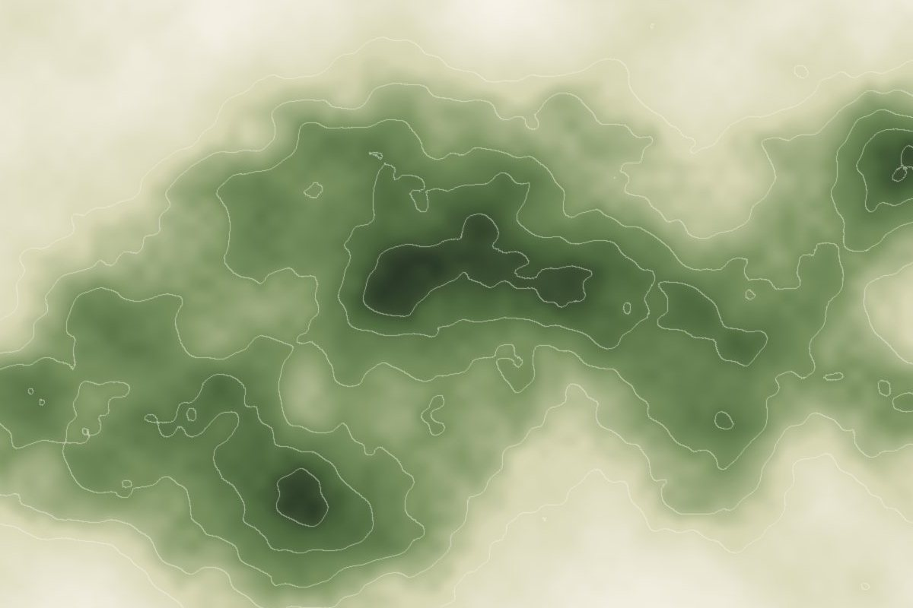
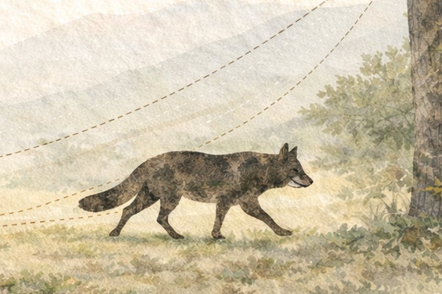

Nuestra investigación se centra en los procesos ecológicos que determinan la distribución y la abundancia de las poblaciones animales. Combinamos trabajo de campo, síntesis de datos a gran escala (anillamiento, ciencia ciudadana, fototrampeo) y modelización cuantitativa para abordar preguntas a distintas escalas espaciales y temporales, e intentamos que los resultados sean útiles para la conservación.

## Líneas de investigación

```{=html}
<div class="card-grid card-grid-2">
  <article class="card-x">
    <figure><picture><source type="image/webp" srcset="../../images/research/movement-card.webp"></picture></figure>
    <div class="card-body">
      <h3><a href="dispersal.html">Movimiento animal en paisajes dinámicos</a></h3>
      <p>Vincular el movimiento con la ecología y la evolución: cómo los movimientos diarios, la migración estacional y la dispersión natal moldean la conectividad, los límites de distribución y la respuesta al cambio ambiental.</p>
      <a class="card-link" href="dispersal.html">Leer más</a>
    </div>
  </article>
  <article class="card-x">
    <figure><picture><source type="image/webp" srcset="../../images/research/sdm-card.webp"></picture></figure>
    <div class="card-body">
      <h3><a href="forecasting.html">Mejorar el seguimiento y la modelización de la biodiversidad</a></h3>
      <p>Modelos de distribución de especies que incorporan procesos ecológicos (dispersión, dinámica poblacional, interacciones) e integran múltiples fuentes de datos.</p>
      <a class="card-link" href="forecasting.html">Leer más</a>
    </div>
  </article>
  <article class="card-x">
    <figure><picture><source type="image/webp" srcset="../../images/research/conservation.webp"></picture></figure>
    <div class="card-body">
      <h3><a href="conservation.html">Conservación de la biodiversidad y cambio global</a></h3>
      <p>Anticipar qué especies afrontan las mayores amenazas, por qué, y dónde y cuándo surgirán los problemas ante el cambio climático y de usos del suelo.</p>
      <a class="card-link" href="conservation.html">Leer más</a>
    </div>
  </article>
  <article class="card-x">
    <figure><picture><source type="image/webp" srcset="../../images/research/fieldtech.webp"></picture></figure>
    <div class="card-body">
      <h3><a href="fieldtech.html">Tecnología de campo</a></h3>
      <p>Fototrampeo, seguimiento acústico pasivo y flujos de datos de sensores para evaluar la fauna en ecosistemas mediterráneos.</p>
      <a class="card-link" href="fieldtech.html">Leer más</a>
    </div>
  </article>
</div>
```

## Enfoque

Nuestro trabajo suele combinar grandes bases de datos y métodos cuantitativos:

- **Datos de recuperación de anillas** de EURING y de los esquemas nacionales, uno de los mayores conjuntos de datos de movimiento animal a nivel individual del mundo
- **Observaciones de ciencia ciudadana**, en especial eBird
- **Modelos jerárquicos bayesianos** implementados en R
- **Fototrampeo y seguimiento bioacústico** en el campo

Apostamos por la ciencia abierta. El código y los datos de nuestros artículos están disponibles en [GitHub](https://github.com/guifandos) y archivados en [Zenodo](https://zenodo.org/search?q=fandos).

## Colaboradores

Trabajamos habitualmente con investigadores de la Universidad de Potsdam, el British Trust for Ornithology, la Estación Ornitológica Suiza, la Humboldt-Universität zu Berlin y varias instituciones españolas. La lista completa está en la página de [Personas](../people.html).
