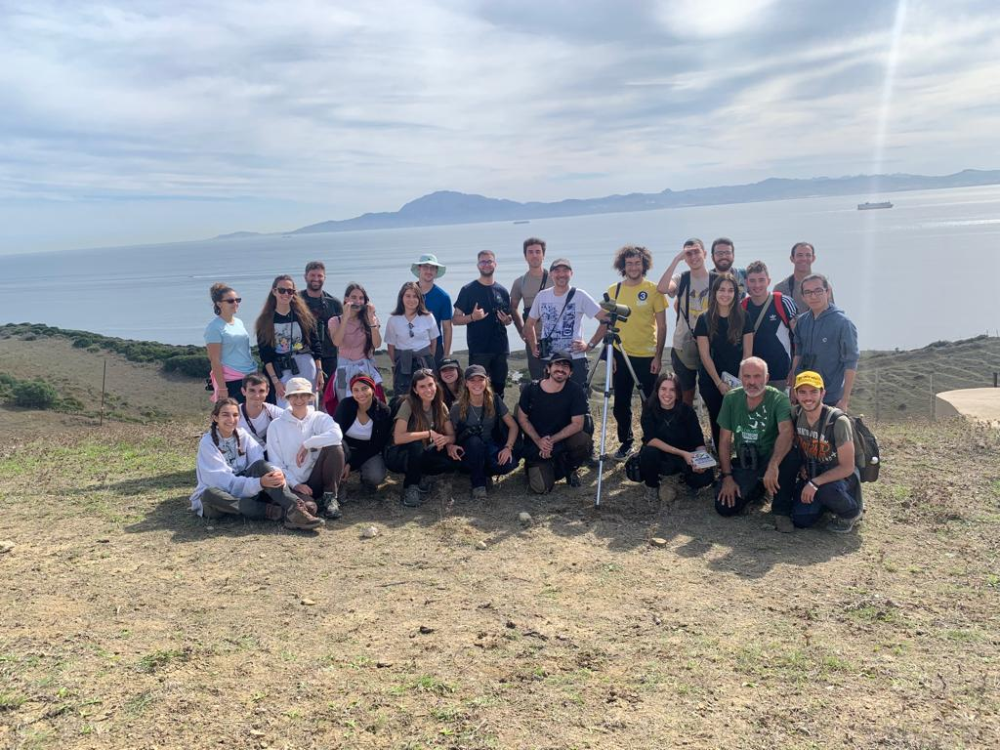

La docencia es una de las partes más gratificantes de mi trabajo. Hay algo profundamente satisfactorio en ver a un estudiante pasar de "no entiendo R" a analizar sus propios datos con soltura, o en ver cómo un curso de campo enciende la pasión de alguien por la ecología.

Creo en aprender haciendo, sea mancharse las manos en el campo o pelearse con datos reales en R. La teoría importa, pero se fija mejor cuando has vivido el desorden de los datos ecológicos de verdad.

{width=100% fig-alt="Curso de campo con estudiantes"}

## Asignaturas en la UCM

### Grado en Biología

- **Zoología**
- **Análisis de la Biodiversidad Animal**

### Máster en Biología de la Conservación

- **Caracterización y seguimiento de poblaciones animales amenazadas**: seguimiento de poblaciones y estimación de abundancia, con un módulo práctico de muestreo de distancias en R.
- **Evaluación Ambiental Aplicada a la Fauna**

### Máster en Zoología

- **Zoología de Vertebrados**

### Escuela de Doctorado

- **Introducción a la programación en R**: curso breve para doctorandos de la Escuela de Doctorado de la UCM, impartido con Daniel Ayllón. Fundamentos de R, manejo de datos e informes reproducibles con Quarto.

### Formación permanente

- **[Aplicaciones Bioinformáticas en Biodiversidad, Ecología y Evolución](https://www.ucm.es/bioinformatica-biodiversidad)**: coordino este curso de experto (150 h, título propio de la UCM) que introduce a los biólogos en las herramientas computacionales para el análisis ecológico y evolutivo.

## Materiales abiertos

- [Quantitative Conservation Biogeography](https://damariszurell.github.io/EEC-QCB/): curso de máster desarrollado con [Damaris Zurell](https://damariszurell.github.io/) en la Universidad de Potsdam. Modelos de distribución, conectividad y planificación de la conservación en R.
- Los tutoriales de muestreo de distancias y de modelos de ocupación con fototrampeo que usamos en los másteres están disponibles bajo petición, y se publicarán aquí a medida que los pongamos a punto.

## Dirección de trabajos

Dirijo TFM y TFG cada curso, normalmente vinculados a nuestros proyectos y datos, y codirijo con colegas de la UCM, UAM, UAH, UCLM y del extranjero. Los estudiantes actuales y los antiguos alumnos están en la página de [Personas](people.html), junto con la información sobre cómo [trabajar con nosotros](people.html#trabaja-con-nosotros).
