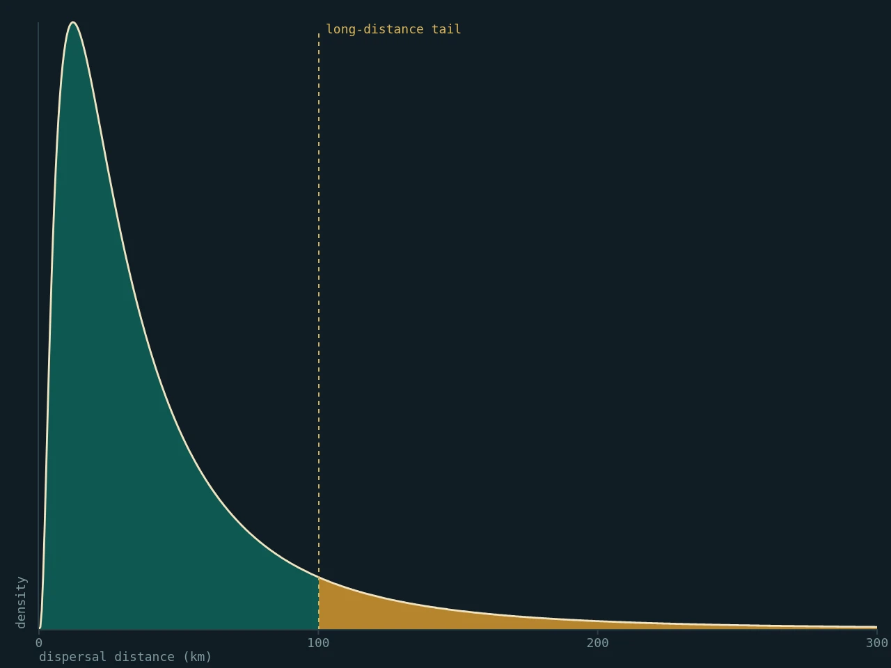
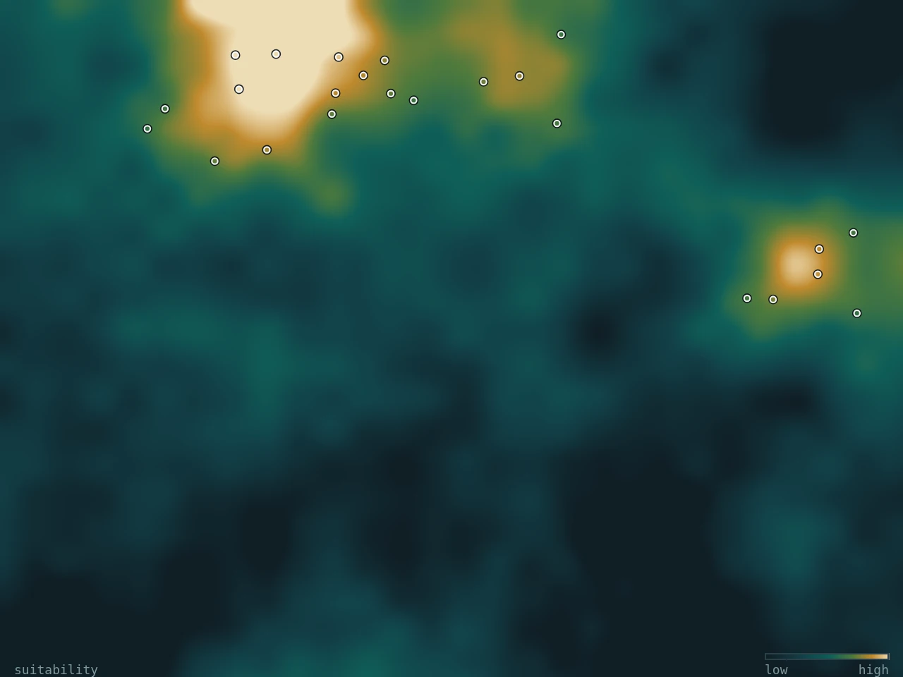
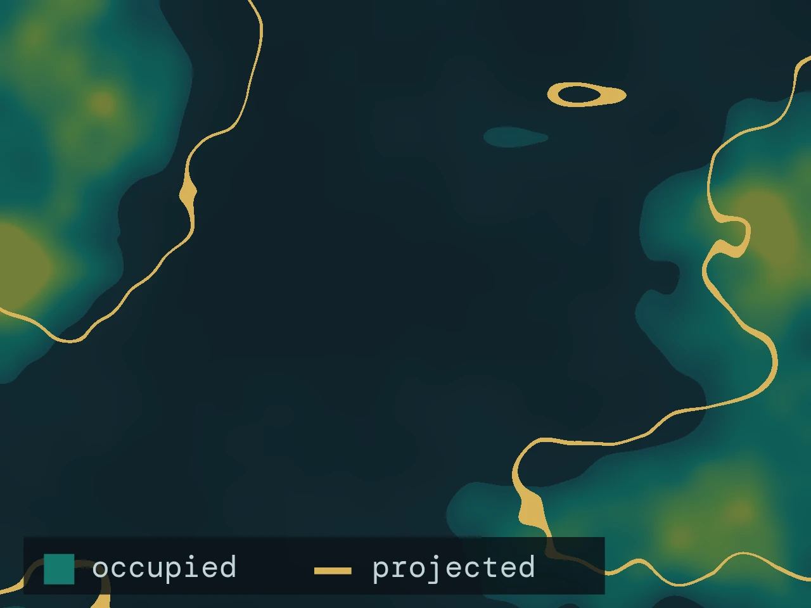
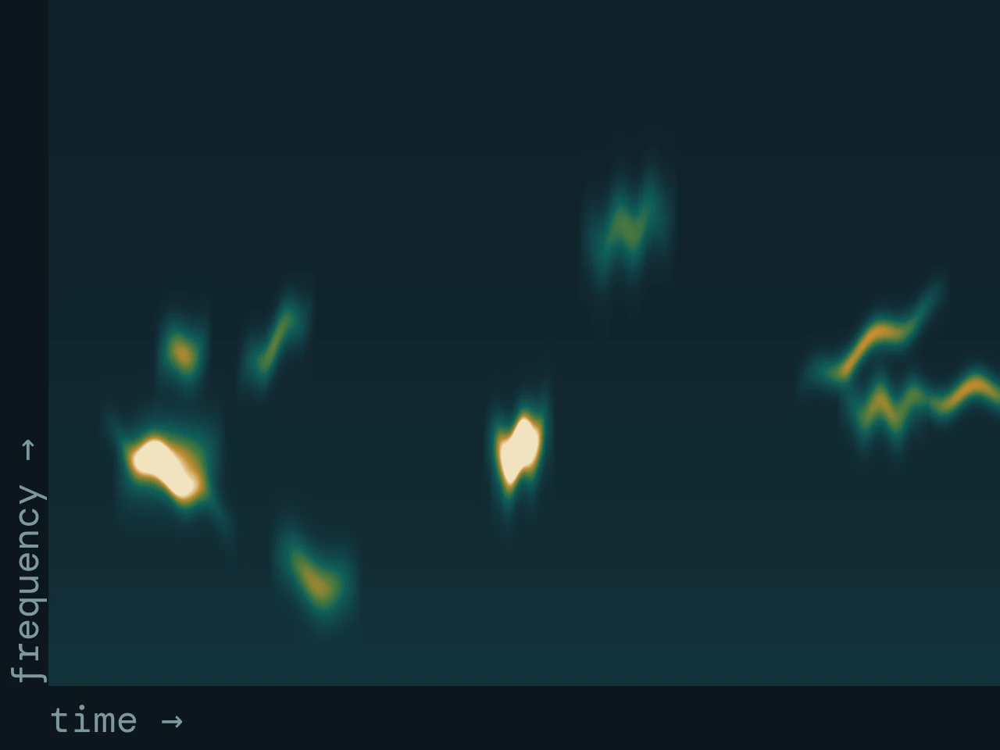
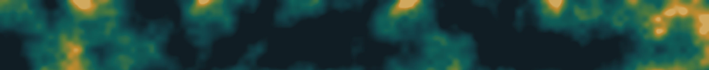

<!--
  Home page. Every section is a fenced div (::: {.class}) styled in
  styles/lattice.scss. To add a publication or a news item, copy one
  ::: {.pub} / ::: {.item} block: the first paragraph is the rail (year or
  date), the rest sits to its right.
-->

::: {.hero}



::: {.wrap .hero-grid}

::: {.hero-text}
[[Dept. Biodiversidad, Ecología y Evolución]{.dept} [Universidad Complutense de Madrid]{.uni}]{.eyebrow}

# Guillermo Fandos

::: {.thesis}
How far animals move, and why individuals of the same species move so differently.
:::

::: {.lede}
I am a spatial ecologist interested in the processes that drive the distribution and abundance of animal populations. My work combines fieldwork, large-scale data synthesis and **quantitative modelling** to tackle questions in conservation biology, biogeography and movement ecology. **Assistant Professor** at the [Universidad Complutense de Madrid](https://www.ucm.es/bee/directorio/?id=29786).
:::

::: {.idlinks}
[gfandos@ucm.es](mailto:gfandos@ucm.es)
[Scholar](https://scholar.google.es/citations?user=8zRbuNgAAAAJ)
[ORCID](https://orcid.org/0000-0003-1579-9444)
[GitHub](https://github.com/guifandos)
[\@g_fandos](https://twitter.com/g_fandos)
:::
:::

::: {.portrait}
{fig-alt="Portrait of Guillermo Fandos"}
:::

:::
:::

::: {.legend}
::: {.wrap}
[Fig. 1]{.tag}

**Schematic.** Simulated natal dispersal from one ringing site. Most trajectories end close to the origin; a few, in ochre, travel an order of magnitude farther. That heavy tail is what makes dispersal hard to estimate and easy to underestimate. Not fitted to data.
:::
:::

::: {.band #research}
::: {.wrap}

::: {.head}
[Research]{.kicker}

## Linking individual movement to where species end up
:::

::: {.lines}

::: {.line}
::: {.rail}
[Data]{.kicker}\
EURING ring recoveries\
National ringing schemes
:::
::: {.text}
### [Animal movement in dynamic landscapes](research/dispersal.qmd)

How do daily movements, seasonal migration and lifetime dispersal events shape population connectivity, range boundaries and species responses to environmental change? I use bird ringing data and Bayesian methods to estimate dispersal kernels and ask what they mean.
:::
::: {.fig}
<!--
  Figure slot. The image is a schematic generated by design/_figures.js and
  exported by design/tools/export-figures.sh. To swap in a real figure from a
  paper, replace the image path (and alt text) below; keep the caption's
  leading **Schematic.** only if the new figure is also schematic. The layout
  and caption styling do not change.
-->
{fig-alt="Schematic dispersal kernel with a heavy right tail shaded in ochre"}
:::
:::

::: {.line}
::: {.rail}
[Data]{.kicker}\
Citizen science (eBird)\
Monitoring surveys · Ring recoveries
:::
::: {.text}
### [Improving biodiversity monitoring and modelling](research/forecasting.qmd)

Effective conservation requires well-designed monitoring and the capacity to anticipate future changes. I develop species distribution models that incorporate ecological processes (dispersal, population dynamics, species interactions) and integrate data sources that were never designed to be combined.
:::
::: {.fig}
{fig-alt="Schematic habitat suitability surface with occurrence records and a colour bar"}
:::
:::

::: {.line}
::: {.rail}
[Data and methods]{.kicker}\
Black Stork monitoring (22 yr)\
Distribution models\
Landscape connectivity
:::
::: {.text}
### [Conservation under global change](research/conservation.qmd)

Habitat degradation and climate change are altering species distributions worldwide. I work on anticipating which species face the greatest threats, understanding why, and identifying where and when problems will emerge: from large carnivore recolonisation in Iberia to mammal declines in the Gran Chaco.
:::
::: {.fig}
{fig-alt="Schematic range map: occupied area against a projected contour"}
:::
:::

::: {.line}
::: {.rail}
[Data]{.kicker}\
AudioMoth recorders\
Camera-trap networks
:::
::: {.text}
### [Field technology for monitoring](outreach.qmd#field-technology)

Camera trapping, bioacoustic monitoring with AudioMoth devices, and other sensor-based approaches for wildlife monitoring. I am developing field technology pipelines for biodiversity assessment, in collaboration with [Raúl Bonal](https://scholar.google.es/citations?user=xKxS6YIAAAAJ) on bioacoustics.
:::
::: {.fig}
{fig-alt="Schematic spectrogram of a dawn chorus, frequency against time"}
:::
:::

:::

::: {.more}
[Research overview →](research/index.qmd)
[Considering a TFM or PhD? Get in touch →](people.qmd#prospective-students)
:::

:::
:::

::: {.strip}
{fig-alt="Schematic landscape permeability surface used as a divider"}
:::

::: {.band .paper #projects}
::: {.wrap}

::: {.head}
[Projects]{.kicker}

## Funded work in progress
:::

::: {.projects}

::: {.project}
[INTRADISP]{.code}

### [Why individuals of one species disperse differently](projects/intradisp.qmd)

Synthesising intraspecific dispersal variation using European bird ringing data to improve predictions of biodiversity responses to global change.

::: {.meta}
Role
:   Principal investigator

Years
:   2024–2026

Host
:   UCM

With
:   Potsdam University, BTO
:::
:::

::: {.project}
[RIMed-Fauna]{.code}

### [Wildlife in Mediterranean rivers](projects/remined.qmd)

Mediterranean rivers flood in winter and run dry in summer. Camera trapping and distribution modelling in National Parks to see how terrestrial wildlife copes with that variability.

::: {.meta}
Role
:   Team member

Years
:   2024–2027

PI
:   M. M. Sánchez-Montoya

Funder
:   Red de Parques Nacionales
:::
:::

::: {.project}
[SHAREPOINT]{.code}

### [Social organisation and parasite sharing](projects/index.qmd#sharepoint)

Rainforest understory birds in French Guiana: field-based research combining network analysis with disease ecology.

::: {.meta}
Role
:   Team member

Years
:   2025–2027

PI
:   J. Pérez-Tris

Funder
:   CEBA
:::
:::

:::

::: {.more}
[All projects, including past ones →](projects/index.qmd)
:::

:::
:::

::: {.band #publications}
::: {.wrap}

::: {.head}
[Selected publications]{.kicker}

## Recent work
:::

::: {.pubs}

::: {.pub}
2026 *Dispersal*

[Dispersal syndromes across the tree of life](https://www.nature.com/articles/s42003-026-09676-x)

**Fandos G**, Robinson RA, Zurell D · *Communications Biology*
:::

::: {.pub}
2023 *Dispersal*

[Standardised empirical dispersal kernels emphasise the pervasiveness of long-distance dispersal in European birds](https://doi.org/10.1111/1365-2656.13838)

**Fandos G**, Talluto M, Fiedler W, Robinson RA, Thorup K, Zurell D · *Journal of Animal Ecology* 92: 158–170
:::

::: {.pub}
2023 *Conservation*

[Large carnivore range expansion in Iberia in relation to different scenarios of permeability of human-dominated landscapes](https://doi.org/10.1111/ddi.13644)

Pratzer M, Nill L, Kuemmerle T, Zurell D, **Fandos G** · *Diversity and Distributions* 29: 75–88
:::

::: {.pub}
2021 *Conservation*

[Habitat destruction and overexploitation drive widespread declines in all facets of mammalian diversity in the Gran Chaco](https://doi.org/10.1111/gcb.15424)

Romero-Muñoz A, **Fandos G**, Benítez-López A, Kuemmerle T · *Global Change Biology* 27: 755–767
:::

::: {.pub}
2020 *Movement*

[Seasonal niche tracking of climate emerges at the population level in a migratory bird](https://doi.org/10.1098/rspb.2020.1799)

**Fandos G**, Rotics S, Sapir N, Fiedler W, Kaatz M, Wikelski M, Nathan R, Zurell D · *Proceedings of the Royal Society B* 287: 20201799
:::

::: {.pub}
2020 *Methods*

[A standard protocol for reporting species distribution models](https://doi.org/10.1111/ecog.04960)

Zurell D, Franklin J, König C, …, **Fandos G**, …, Merow C · *Ecography* 43: 1261–1277
:::

:::

::: {.more}
[All selected papers →](publications.qmd)
[Full list on Google Scholar →](https://scholar.google.es/citations?user=8zRbuNgAAAAJ)
[Code on GitHub →](https://github.com/guifandos)
:::

:::
:::

::: {.band .paper #news}
::: {.wrap}

::: {.head}
[News]{.kicker}

## Lately
:::

::: {.news}

::: {.item}
Feb 2026

New paper in *Communications Biology*: [Dispersal syndromes across the tree of life](https://www.nature.com/articles/s42003-026-09676-x) (Fandos et al. 2026).
:::

::: {.item}
Feb 2026

In Vienna for the [EUFLYNET](https://www.cost.eu/actions/CA22117/) COST Action meeting on bird migration research.
:::

::: {.item}
2025

Welcome to **David Notario** and **Claudia Mediavilla**, joining as researchers on [INTRADISP](projects/intradisp.qmd) and [RIMed-Fauna](projects/remined.qmd).
:::

:::

:::
:::
