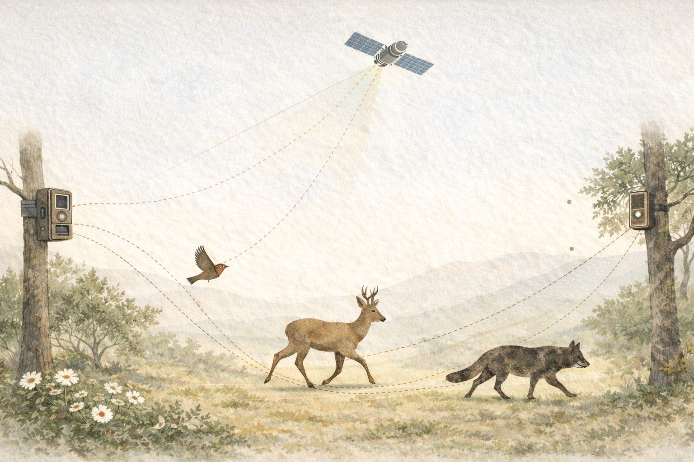
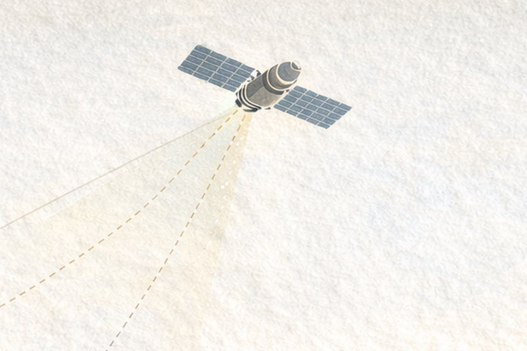
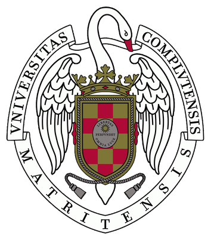

```{=html}
<section class="hero" aria-label="Introduction">
  <picture>
    <source type="image/webp" srcset="images/hero-sm.webp 900w, images/hero.webp 1536w" sizes="100vw">
    
  </picture>
  <svg class="hero-paths" viewBox="0 0 1600 900" preserveAspectRatio="xMidYMid slice" aria-hidden="true" focusable="false">
    <path d="M-40 620 C 260 540, 420 700, 700 560 S 1120 420, 1400 520 S 1580 640, 1700 600" />
    <path d="M-40 760 C 200 700, 380 820, 640 720 S 980 560, 1260 640 S 1520 760, 1700 700" />
    <path d="M 120 -20 C 300 160, 520 220, 760 180 S 1100 60, 1300 200 S 1500 420, 1700 380" />
  </svg>
  <div class="wrap hero-inner">
    <span class="eyebrow">Quantitative biodiversity analysis · Movement ecology · UCM</span>
    <h1>Guillermo Fandos</h1>
    <p class="hero-tagline">We study how animals move, where they live, and how to keep them there.</p>
    <p class="hero-affil">Quantitative biodiversity analysis, animal movement and conservation<br>Dept. Biodiversidad, Ecología y Evolución · Universidad Complutense de Madrid</p>
    <div class="hero-actions">
      <a class="btn btn-primary" href="research/index.html">Our research</a>
      <a class="btn btn-outline-dark" href="people.html#work-with-us">Work with us</a>
    </div>
  </div>
</section>

<section class="section">
  <div class="wrap wrap-narrow">
    <span class="eyebrow">About</span>
    <p class="lead-text">I'm Guillermo Fandos, a spatial ecologist and Assistant Professor at Universidad Complutense de Madrid. My research is the quantitative analysis of biodiversity: where animals occur, how they move, and how populations respond to a changing world. I am a member of the <a href="https://www.ucm.es/bcv/">Biología y Conservación Evolutiva</a> research group at UCM.</p>
    <p class="lead-text">Together with my students and collaborators, we combine fieldwork, large-scale data synthesis (bird ringing, citizen science, camera traps, acoustic sensors) and Bayesian modelling, with a particular focus on animal movement and dispersal. Much of this work is done with partners at the University of Potsdam, the British Trust for Ornithology and the Swiss Ornithological Institute.</p>
  </div>
</section>

<section class="stats" aria-label="Key figures">
  <div class="wrap stats-grid">
    <div class="stat"><span class="stat-n">234</span><span class="stat-l">European bird species with standardised dispersal kernels</span></div>
    <div class="stat"><span class="stat-n">3</span><span class="stat-l">active funded projects, one as principal investigator</span></div>
    <div class="stat"><span class="stat-n">16</span><span class="stat-l">MSc and BSc theses supervised since 2021</span></div>
    <div class="stat"><span class="stat-n">5</span><span class="stat-l">countries of fieldwork, from the Strait of Gibraltar to French Guiana</span></div>
  </div>
</section>

<section class="section section-alt">
  <div class="wrap">
    <div class="section-head">
      <div>
        <span class="eyebrow">Research</span>
        <h2>Four lines of work, one question</h2>
        <p>How do animal movement and environmental change together shape the distribution of species, and what can we do about it?</p>
      </div>
      <a class="more" href="research/index.html">Research overview &rarr;</a>
    </div>
    <div class="card-grid">
      <article class="card-x">
        <figure><picture><source type="image/webp" srcset="images/research/dispersal.webp"></picture></figure>
        <div class="card-body">
          <h3><a href="research/dispersal.html">Movement &amp; Dispersal</a></h3>
          <p>From daily foraging to natal dispersal: how far animals move, why it varies, and what it means for connectivity and range dynamics.</p>
          <a class="card-link" href="research/dispersal.html">Read more</a>
        </div>
      </article>
      <article class="card-x">
        <figure><picture><source type="image/webp" srcset="images/research/monitoring.webp"></picture></figure>
        <div class="card-body">
          <h3><a href="research/forecasting.html">Monitoring &amp; Modelling</a></h3>
          <p>Species distribution models that include dispersal, demography and species interactions, and integrate surveys with citizen science.</p>
          <a class="card-link" href="research/forecasting.html">Read more</a>
        </div>
      </article>
      <article class="card-x">
        <figure><picture><source type="image/webp" srcset="images/research/conservation.webp"></picture></figure>
        <div class="card-body">
          <h3><a href="research/conservation.html">Conservation &amp; Global Change</a></h3>
          <p>Large carnivore expansion, threatened species assessment and landscape connectivity under climate and land-use change.</p>
          <a class="card-link" href="research/conservation.html">Read more</a>
        </div>
      </article>
      <article class="card-x">
        <figure><picture><source type="image/webp" srcset="images/research/fieldtech.webp"></picture></figure>
        <div class="card-body">
          <h3><a href="research/fieldtech.html">Field Technology</a></h3>
          <p>Camera trapping, passive acoustic monitoring and sensor pipelines for wildlife assessment in Mediterranean ecosystems.</p>
          <a class="card-link" href="research/fieldtech.html">Read more</a>
        </div>
      </article>
    </div>
  </div>
</section>

<section class="section">
  <div class="wrap">
    <div class="section-head">
      <div>
        <span class="eyebrow">Projects</span>
        <h2>Active projects</h2>
      </div>
      <a class="more" href="projects/index.html">All projects &rarr;</a>
    </div>
    <div class="card-grid">
      <article class="card-x card-project">
        <div class="card-body">
          <span class="card-meta">Principal Investigator · 2024–2026</span>
          <h3><a href="projects/intradisp.html">INTRADISP</a></h3>
          <p>Why do individuals of the same species disperse so differently? Quantifying intraspecific dispersal variation with European bird ringing data.</p>
          <a class="card-link" href="projects/intradisp.html">About the project</a>
        </div>
      </article>
      <article class="card-x card-project">
        <div class="card-body">
          <span class="card-meta">Team member · 2024–2027</span>
          <h3><a href="projects/remined.html">RIMed-Fauna</a></h3>
          <p>How does terrestrial wildlife cope with the extreme seasonality of Mediterranean rivers? Camera trapping and SDMs in Spanish National Parks.</p>
          <a class="card-link" href="projects/remined.html">About the project</a>
        </div>
      </article>
      <article class="card-x card-project">
        <div class="card-body">
          <span class="card-meta">Team member · 2025–2027</span>
          <h3><a href="projects/sharepoint.html">SHAREPOINT</a></h3>
          <p>Social organisation and parasite sharing among rainforest understory birds in French Guiana.</p>
          <a class="card-link" href="projects/sharepoint.html">About the project</a>
        </div>
      </article>
    </div>
  </div>
</section>

<section class="section section-alt">
  <div class="wrap">
    <div class="feature">
      <figure>
        <picture><source type="image/webp" srcset="images/research/dispersal.webp"></picture>
      </figure>
      <div>
        <span class="eyebrow">Featured paper</span>
        <h3>Simple mechanistic traits outperform complex syndromes in predicting avian dispersal distances</h3>
        <p class="cite">Fandos, G., Robinson, R. A. &amp; Zurell, D. (2026). <em>Communications Biology</em> 9: 376.</p>
        <p>Using the most comprehensive empirical dispersal dataset for European birds, we show that single mechanistic traits predict dispersal better than composite syndromes. Body mass and life history dominate median dispersal distance, while flight efficiency shapes the long-distance movements that drive range expansion.</p>
        <div class="hero-actions">
          <a class="btn btn-primary" href="https://doi.org/10.1038/s42003-026-09676-x">Read the paper</a>
          <a class="btn btn-outline-dark" href="https://zenodo.org/records/10713958">Code &amp; data</a>
        </div>
      </div>
    </div>
  </div>
</section>

<section class="section">
  <div class="wrap wrap-narrow">
    <div class="section-head">
      <div>
        <span class="eyebrow">News</span>
        <h2>Latest news</h2>
      </div>
      <a class="more" href="news/index.html">All news &rarr;</a>
    </div>
```

::: {#news-home}
:::

```{=html}
  </div>
</section>

<section class="section section-tint">
  <div class="wrap">
    <div class="section-head">
      <div>
        <span class="eyebrow">People</span>
        <h2>The team</h2>
      </div>
      <a class="more" href="people.html">Meet everyone &rarr;</a>
    </div>
    <div class="team-strip">
      <a class="member" href="people.html">
        
        <span><span class="name">Guillermo Fandos</span><br><span class="role">Principal Investigator</span></span>
      </a>
      <a class="member" href="people.html">
        <span class="avatar avatar-initials" aria-hidden="true">DN</span>
        <span><span class="name">David Notario</span><br><span class="role">Research assistant · INTRADISP</span></span>
      </a>
      <a class="member" href="people.html">
        <span class="avatar avatar-initials" aria-hidden="true">CM</span>
        <span><span class="name">Claudia Mediavilla</span><br><span class="role">PhD candidate · RIMed-Fauna</span></span>
      </a>
      <a class="member" href="people.html">
        <span class="avatar avatar-initials" aria-hidden="true">HD</span>
        <span><span class="name">Hugo Díaz</span><br><span class="role">PhD student · CE3C</span></span>
      </a>
      <a class="member" href="people.html#visiting-researchers">
        <span class="avatar avatar-initials" aria-hidden="true">JH</span>
        <span><span class="name">Jakub Hrouda</span><br><span class="role">Visiting student · Prague</span></span>
      </a>
    </div>
  </div>
</section>

<section class="section">
  <div class="wrap">
    <div class="callout-join">
      <div>
        <h2>Interested in working with us?</h2>
        <p>We welcome motivated students for TFM, PhD and postdoctoral projects in quantitative biodiversity analysis, animal movement and conservation. <a href="people.html#work-with-us">Read how to get in touch</a>.</p>
      </div>
      <a class="btn btn-outline-light" href="mailto:gfandos@ucm.es">Write to us</a>
    </div>
  </div>
</section>

<section class="section section-alt" id="contact">
  <div class="wrap">
    <div class="feature" style="align-items:start">
      <div>
        <span class="eyebrow">Contact</span>
        <h2 style="margin-top:0">Find us</h2>
        <p><strong>Guillermo Fandos</strong><br>
        Departamento de Biodiversidad, Ecología y Evolución<br>
        Facultad de Ciencias Biológicas, Universidad Complutense de Madrid<br>
        C/ José Antonio Novais 12, 28040 Madrid, Spain</p>
        <p><a href="mailto:gfandos@ucm.es">gfandos@ucm.es</a></p>
      </div>
      <div class="logo-row">
        
      </div>
    </div>
  </div>
</section>
```
