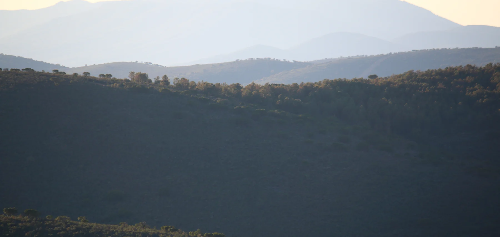
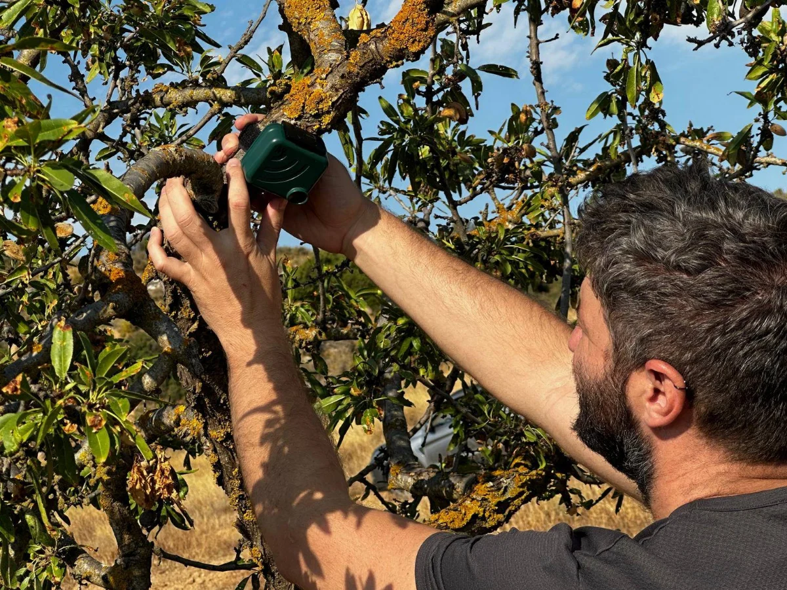
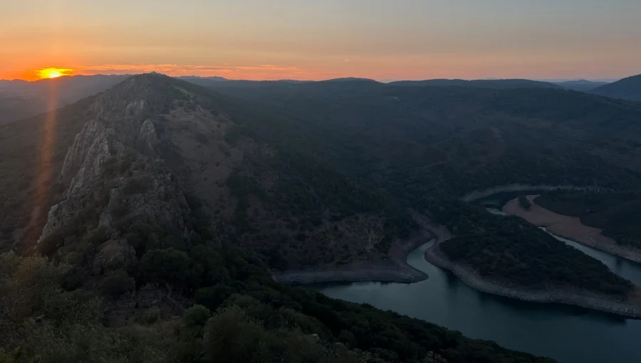

<!--
  Home page. Every section is a fenced div (::: {.class}) styled in
  styles/lattice.scss. A section head is ::: {.head} with an optional mono
  kicker in the rail column and the h2 as the title; add a kicker only when
  it says something the h2 does not (as on Research and Projects).
  To add a publication or a news item, copy one ::: {.pub} / ::: {.item}
  block: the first paragraph is the rail (year or date), the rest sits to
  its right.
  Projects are ::: {.tile} blocks inside ::: {.tiles}; see the comment above
  them for how to add one or swap a photograph in.
  Photographs: the portrait, the landscape band, the field photo and the
  project tile are credited in the ::: {.credits} block at the end of the
  page. The landscape is CC BY-SA 4.0 (Wikimedia Commons); keep its credit if
  you keep the image.
-->

::: {.hero}
::: {.wrap .hero-grid}

::: {.hero-text}
::: {.eyebrow}
Dept. Biodiversidad, Ecología y Evolución · Universidad Complutense de Madrid
:::

# Guillermo Fandos

::: {.role}
Quantitative ecologist · Assistant Professor
:::

::: {.motto}
Understanding where species live, how they move, and how that is changing.
:::

::: {.lede}
I study the processes that shape the distribution and abundance of animal populations, combining fieldwork, large-scale data synthesis and statistical modelling to address questions in biogeography, movement ecology and conservation.
:::

::: {.idlinks}
[gfandos@ucm.es](mailto:gfandos@ucm.es)
[Google Scholar](https://scholar.google.es/citations?user=8zRbuNgAAAAJ)
[ORCID](https://orcid.org/0000-0003-1579-9444)
[GitHub](https://github.com/guifandos)
:::
:::

::: {.portrait}
{fig-alt="Portrait of Guillermo Fandos"}
:::

:::
:::

::: {.place}
{fig-alt="Sierras de Cabañeros, Parque Nacional de Cabañeros: layered hills in evening haze"}
:::

::: {.band #research}
::: {.wrap}

::: {.head}
[Research]{.kicker}

## Understanding and forecasting where species live, and how that is changing
:::

::: {.lines}

::: {.line}
::: {.rail}
[Themes]{.kicker}
Movement ecology\
Biogeography
:::
::: {.text}
### [Movement and the geography of species](research/dispersal.qmd)

Animals move at every scale, from a morning's foraging to a lifetime's dispersal, and those movements set where populations persist, how connected they are and how fast ranges can shift. I study how individual movement scales up to population and range dynamics, and why individuals of the same species differ so much in how far they go.
:::
::: {.fig}
<!--
  Figure slot. The image is a schematic generated by design/_figures.js and
  exported by design/tools/export-figures.sh. To swap in a real figure from a
  paper, replace the image path (and alt text) below; keep the caption's
  leading **Schematic.** only if the new figure is also schematic. The layout
  and caption styling do not change.
-->
{fig-alt="Schematic dispersal kernel with a heavy right tail shaded in ochre"}
:::
:::

::: {.line}
::: {.rail}
[Themes]{.kicker}
Statistical ecology\
Species distribution modelling
:::
::: {.text}
### [Biodiversity modelling and forecasting](research/forecasting.qmd)

Most models of species distributions describe where a species is found, not the processes that put it there. I develop models that carry ecological process explicitly — dispersal, population dynamics, species interactions, imperfect detection — and that integrate heterogeneous data, so that forecasts of biodiversity change rest on mechanism rather than correlation.
:::
::: {.fig}
{fig-alt="Schematic habitat suitability surface with occurrence records and a colour bar"}
:::
:::

::: {.line}
::: {.rail}
[Themes]{.kicker}
Conservation biology\
Global change
:::
::: {.text}
### [Conservation under global change](research/conservation.qmd)

Habitat loss and climate change are redrawing species distributions. I work on anticipating which species are most exposed and why, and on turning that understanding into spatial priorities: where and when problems will emerge, and where intervention is most likely to matter.
:::
::: {.fig}
{fig-alt="Schematic range map: occupied area against a projected contour"}
:::
:::

::: {.line}
::: {.rail}
[Themes]{.kicker}
Ecological monitoring\
Emerging technologies
:::
::: {.text}
### [Monitoring biodiversity at scale](outreach.qmd#field-technology)

Good inference needs good observation. I work on how autonomous sensors, citizen science and long-term surveys can be designed and combined to monitor wildlife at the scales that conservation decisions require, and on the analytical pipelines that turn raw observations into evidence.
:::
::: {.fig}
<!-- A photograph, not a schematic, so the caption is factual and carries no "Schematic." label. -->
{fig-alt="Guillermo Fandos fastening an AudioMoth acoustic recorder to an almond tree"}
:::
:::

:::

::: {.more}
[Research overview →](research/index.qmd)
[Considering a TFM or PhD? Get in touch →](people.qmd#prospective-students)
:::

:::
:::

::: {.band .projects-band #projects}
::: {.wrap}

::: {.head}
[Projects]{.kicker}

## Funded work in progress
:::

<!--
  Project tiles (BRIEF.md section 11). Each ::: {.tile} holds an ::: {.img}
  block and a ::: {.body} block: mono code line (acronym · years), a title
  whose link makes the whole tile clickable, one paragraph, then a definition
  list (term, then ":   value"). A tile without a photograph uses
  ::: {.img .blank} with nothing inside; to add the photo later, replace that
  empty block with ::: {.img} and an image line (see the RIMed-Fauna tile).
  Photographs are credited in the ::: {.credits} block at the end of the page.
-->
::: {.tiles}

::: {.tile}
::: {.img .blank}
:::
::: {.body}
[INTRADISP · 2024–2026]{.code}

### [Why individuals of one species disperse differently](projects/intradisp.qmd)

Synthesising intraspecific dispersal variation using European bird ringing data to improve predictions of biodiversity responses to global change.

Role
:   Principal investigator

Host
:   UCM

With
:   Potsdam University, BTO
:::
:::

::: {.tile}
::: {.img}
{fig-alt="Salto del Gitano and the Tajo at dusk, Parque Nacional de Monfragüe"}
:::
::: {.body}
[RIMed-Fauna · 2024–2027]{.code}

### [Wildlife in Mediterranean rivers](projects/remined.qmd)

Mediterranean rivers flood in winter and run dry in summer. Camera trapping and distribution modelling in National Parks to see how terrestrial wildlife copes with that variability.

Role
:   Team member

PI
:   M. M. Sánchez-Montoya

Funder
:   Red de Parques Nacionales
:::
:::

::: {.tile}
::: {.img .blank}
:::
::: {.body}
[SHAREPOINT · 2025–2027]{.code}

### [Social organisation and parasite sharing](projects/index.qmd#sharepoint)

Rainforest understory birds in French Guiana: field-based research combining network analysis with disease ecology.

Role
:   Team member

PI
:   J. Pérez-Tris

Funder
:   CEBA
:::
:::

:::

::: {.more}
[All projects, including past ones →](projects/index.qmd)
:::

:::
:::

::: {.band #publications}
::: {.wrap}

::: {.head}
## Selected publications
:::

::: {.pubs}

::: {.pub}
2026 *Dispersal*

[Dispersal syndromes across the tree of life](https://www.nature.com/articles/s42003-026-09676-x)

**Fandos G**, Robinson RA, Zurell D · *Communications Biology*
:::

::: {.pub}
2023 *Dispersal*

[Standardised empirical dispersal kernels emphasise the pervasiveness of long-distance dispersal in European birds](https://doi.org/10.1111/1365-2656.13838)

**Fandos G**, Talluto M, Fiedler W, Robinson RA, Thorup K, Zurell D · *Journal of Animal Ecology* 92: 158–170
:::

::: {.pub}
2023 *Conservation*

[Large carnivore range expansion in Iberia in relation to different scenarios of permeability of human-dominated landscapes](https://doi.org/10.1111/ddi.13644)

Pratzer M, Nill L, Kuemmerle T, Zurell D, **Fandos G** · *Diversity and Distributions* 29: 75–88
:::

::: {.pub}
2021 *Conservation*

[Habitat destruction and overexploitation drive widespread declines in all facets of mammalian diversity in the Gran Chaco](https://doi.org/10.1111/gcb.15424)

Romero-Muñoz A, **Fandos G**, Benítez-López A, Kuemmerle T · *Global Change Biology* 27: 755–767
:::

::: {.pub}
2020 *Movement*

[Seasonal niche tracking of climate emerges at the population level in a migratory bird](https://doi.org/10.1098/rspb.2020.1799)

**Fandos G**, Rotics S, Sapir N, Fiedler W, Kaatz M, Wikelski M, Nathan R, Zurell D · *Proceedings of the Royal Society B* 287: 20201799
:::

::: {.pub}
2020 *Methods*

[A standard protocol for reporting species distribution models](https://doi.org/10.1111/ecog.04960)

Zurell D, Franklin J, König C, …, **Fandos G**, …, Merow C · *Ecography* 43: 1261–1277
:::

:::

::: {.more}
[All selected papers →](publications.qmd)
[Full list on Google Scholar →](https://scholar.google.es/citations?user=8zRbuNgAAAAJ)
[Code on GitHub →](https://github.com/guifandos)
:::

:::
:::

::: {.band .paper #news}
::: {.wrap}

::: {.head}
## News
:::

::: {.news}

::: {.item}
Feb 2026

New paper in *Communications Biology*: [Dispersal syndromes across the tree of life](https://www.nature.com/articles/s42003-026-09676-x) (Fandos et al. 2026).
:::

::: {.item}
Feb 2026

In Vienna for the [EUFLYNET](https://www.cost.eu/actions/CA22117/) COST Action meeting on bird migration research.
:::

::: {.item}
2025

Welcome to **David Notario** and **Claudia Mediavilla**, joining as researchers on [INTRADISP](projects/intradisp.qmd) and [RIMed-Fauna](projects/remined.qmd).
:::

:::

:::
:::

::: {.credits}
::: {.wrap}
[Photographs]{.kicker}

Portrait: Guillermo Fandos, PhD in Ecology 2017, Universidad Complutense de Madrid. · Landscape: Sierras de Cabañeros, Parque Nacional de Cabañeros — photo [FrDr](https://commons.wikimedia.org/wiki/File:Parque_nacional_de_Caba%C3%B1eros_40.jpg), CC BY-SA 4.0, via Wikimedia Commons. · Field: deploying an AudioMoth acoustic recorder on an almond tree, photo Guillermo Fandos. · Project tile: Salto del Gitano and the Tajo, Parque Nacional de Monfragüe, photo Guillermo Fandos. · Research figures marked Schematic are generated illustrations, not fitted to data.
:::
:::
