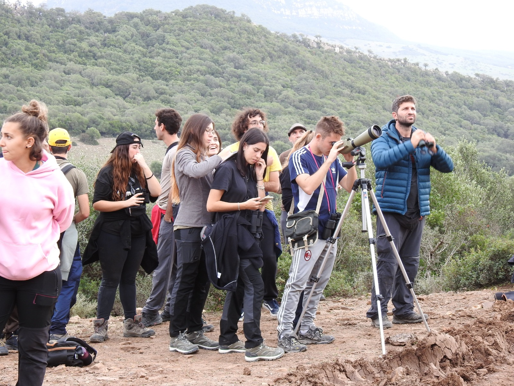

## Science Communication

I enjoy sharing science beyond academic circles. I've participated in public engagement events like **Pint of Science** (as speaker in Berlin and co-coordinator in Potsdam) and **La Noche de los Investigadores**, where I've run workshops on bat ecology and camera trapping.

{width=100% fig-alt="Science outreach in the field"}

---

## Editorial Work

I serve as **Editor for [Ardeola](https://www.ardeola.org/)**, the scientific journal of the Spanish Ornithological Society (SEO/BirdLife). I also regularly review manuscripts for journals across ecology and conservation.

---

## Citizen Science

I'm an active contributor and reviewer for [eBird](https://ebird.org/home), helping maintain data quality for one of the largest citizen science projects in the world. Citizen science data also play a central role in my [research on biodiversity monitoring](research/forecasting.qmd).

---

## Field Experience

Beyond current projects, I've participated in fieldwork in:

- **French Guiana**: Rainforest bird communities (CEBA projects)
- **Honduras**: Small mammal research with Operation Wallacea
- **Costa Rica**: Mammal ecology at La Selva Biological Station
- **Spain & Morocco**: Various bird monitoring projects
