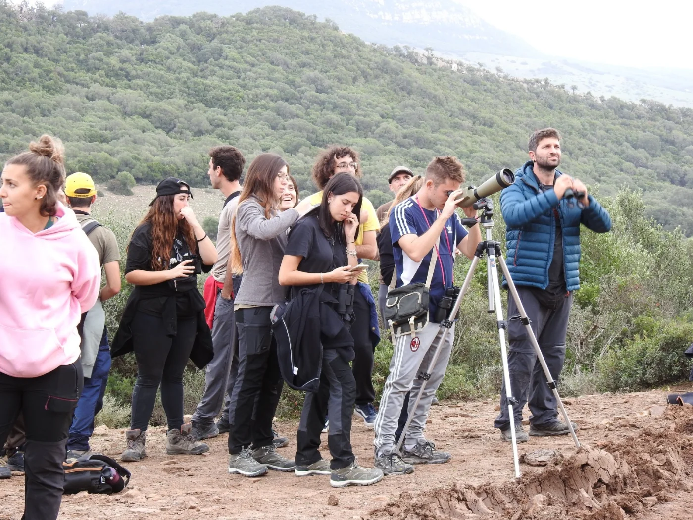

## Field technology

I'm fascinated by how new technology can transform ecological research. Currently I'm working with:

**Camera trapping**: Deploying camera trap networks in Mediterranean ecosystems as part of the [RIMed-Fauna](projects/remined.qmd) project. There's something exciting about checking SD cards and discovering what walked past while you weren't there.

**Bioacoustics**: Collaborating with [Raúl Bonal](https://scholar.google.es/citations?user=xKxS6YIAAAAJ) on AudioMoth deployments for acoustic wildlife monitoring. Passive acoustic monitoring opens up possibilities for studying species that are hard to detect visually.

## Science communication

I enjoy sharing science beyond academic circles. I've participated in public engagement events like **Pint of Science** (as speaker in Berlin and co-coordinator in Potsdam) and **La Noche de los Investigadores**, where I've run workshops on bat ecology and camera trapping.

::: {.banner}
<!-- images/derived/outreach-field-1400.webp is a downscaled copy of
     images/outreach-field.jpg made by design/tools/derive-images.sh;
     the original is untouched. -->
{fig-alt="Science outreach in the field"}
:::

I'm also an active contributor and reviewer for [eBird](https://ebird.org/home), helping maintain data quality for one of the largest citizen science projects in the world.

## Editorial work

I serve as **Editor for Ardeola**, the scientific journal of the Spanish Ornithological Society (SEO/BirdLife). I also regularly review manuscripts for journals across ecology and conservation.

## Field experience

Beyond current projects, I've participated in expeditions in:

- **French Guiana**: Rainforest bird communities (CEBA projects)
- **Honduras**: Small mammal research with Operation Wallacea
- **Costa Rica**: Mammal ecology at La Selva Biological Station
- **Spain & Morocco**: Various bird monitoring projects

## Open science

I'm committed to making research reproducible. Code and data for my papers are available on [GitHub](https://github.com/guifandos) and archived on [Zenodo](https://zenodo.org/search?q=fandos).
